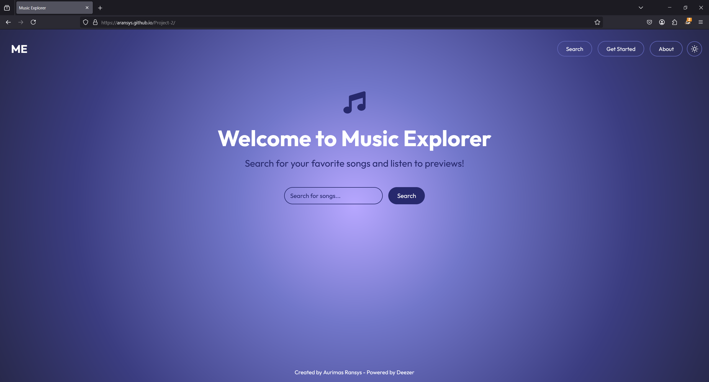

# 📌 Music Explorer: Project Documentation

## 📱 Project Overview

Music Explorer is a dynamic, interactive web application that enables users to discover and preview music tracks from the Deezer music library. The project showcases modern front-end development techniques using vanilla JavaScript, CSS3, and HTML5, focusing on creating an intuitive, responsive user interface with real-time music preview capabilities.

The application was developed with a focus on user experience, accessibility, and clean, maintainable code architecture. It demonstrates proficiency in API integration, responsive design principles, and interactive UI development without relying on external JavaScript frameworks.

## 🎯 Purpose of the Website

Music Explorer serves as a comprehensive digital platform designed to connect music enthusiasts with a vast library of songs. Its primary purposes include:

### 1. Music Discovery

- Provide an intuitive interface for searching and discovering music
- Enable users to quickly find tracks by artists, titles, or keywords
- Present search results in an organized, visually appealing grid layout

### 2. Audio Previewing

- Allow users to listen to song previews directly in the browser
- Provide playback controls including play/pause and volume adjustment
- Display real-time playback progress with visual indicators

### 3. Interactive User Experience

- Deliver immediate visual feedback for user actions
- Implement smooth transitions and animations for engaging interactions
- Offer sorting capabilities to organize search results by different criteria

### 4. Responsive Access

- Ensure optimal experience across devices (mobile, tablet, desktop)
- Maintain usability and visual appeal at all screen sizes
- Implement touch-friendly controls for mobile users

### 5. Visual Customization

- Provide theme options (dark/light) to accommodate user preferences
- Implement visually consistent design language across all features
- Enhance user engagement through thoughtful visual design

## 🎨 UX Section

### User Goals

The primary goals for users of the Music Explorer website include:

1. **Effortless Music Searching**

   - Quick access to a search interface for finding favorite songs
   - Immediate display of relevant search results
   - Clear visual representation of track information

2. **Seamless Audio Playback**

   - One-click access to song previews
   - Intuitive audio controls for playback management
   - Real-time progress tracking during playback

3. **Organized Content Exploration**

   - Ability to sort search results by different criteria
   - Clear visual distinction between tracks currently playing and others
   - Responsive grid layout that adapts to different device screens

4. **Visual Preference Customization**

   - Option to switch between dark and light themes
   - Consistent visual experience regardless of chosen theme
   - Smooth transition when switching between themes

5. **Intuitive Navigation**
   - Clear, accessible navigation controls
   - Logical content organization
   - Back-to-top functionality for longer result sets

### Developer Goals

As a developer, the objectives for the website were:

1. **Clean Code Architecture**

   - Modular JavaScript structure with clear separation of concerns
   - Consistent naming conventions and code organization
   - Well-documented functions and code blocks
   - Efficient state management without external libraries

2. **Responsive Design Implementation**

   - Mobile-first approach to ensure compatibility across devices
   - Fluid layouts using CSS Grid and Flexbox
   - Strategic use of media queries for breakpoint management
   - Touch-friendly interface elements for mobile users

3. **Performance Optimization**

   - Efficient DOM manipulation to prevent layout thrashing
   - Optimized event handling with proper event delegation
   - Resource management for audio elements
   - Smooth animations with GPU acceleration where appropriate

4. **API Integration**

   - Clean implementation of Deezer API via RapidAPI
   - Robust error handling for API requests
   - Efficient data processing and display
   - User-friendly loading and error states

5. **User Experience Enhancement**
   - Meaningful animations and transitions
   - Immediate visual feedback for user actions
   - Intuitive control interfaces with proper affordances
   - Consistent design language throughout the application

### Design Choices

#### Fonts

- **Google Fonts - Outfit**: Selected for its clean, modern, and highly legible qualities across different weights. The font works well for both headings and body text, providing a consistent typographic experience.
- **Font Hierarchy**:
  - Headings: 4rem (welcome heading) to 1.2rem (track names)
  - Body text: 1.1rem
  - Secondary text: 0.9rem (artist names, duration)
- **Reasoning**: The Outfit font family provides excellent readability while maintaining a contemporary aesthetic that aligns with the music discovery theme.

#### Icons

- **Font Awesome Icons**: Implemented for interactive elements and status indicators, providing consistent and recognizable visual cues.
- **Custom SVG Icons**: Used for the theme toggle and back-to-top buttons, allowing for theme-specific styling and animation.
- **Reasoning**: Icons enhance the user interface by providing intuitive visual cues for interactive elements, improving usability without cluttering the design.

#### Colors

- **Dark Theme (Default)**:

  - Primary Palette:
    - Purple/Blue Gradient: (#a393eb to #27296d) - Creates an immersive, music-themed environment
    - White Text (#ffffff) - Ensures readability against the dark background
    - Secondary Accent (#5e63b6) - Provides visual hierarchy for interactive elements
  - Background: Radial gradient with subtle pattern overlay for depth

- **Light Theme**:

  - Light Background: Soft white to lavender gradient for a clean, airy feel
  - Dark Text (#27296d) - Maintains readability while connecting to the brand color scheme
  - Secondary Accent (#5e63b6) - Preserves brand identity across themes

- **Reasoning**: The color scheme was chosen to create an immersive, music-focused environment while ensuring accessibility. The purple-blue palette evokes creativity and musical exploration while providing sufficient contrast for text readability.

#### Styling

- **Card Design**: Rounded corners with subtle shadows to create a modern, floating effect
- **Button Styles**: Pill-shaped with hover animations for clear interactive feedback
- **Animations**: Subtle transitions and feedback animations to enhance user experience
- **Reasoning**: These styling choices create visual hierarchy, guide user attention, and provide immediate feedback for interactions.

#### Backgrounds

- **Gradient Backgrounds**: Dynamic radial gradients that create depth and visual interest
- **Pattern Overlay**: Subtle diagonal pattern adds texture without distracting from content
- **Card Backgrounds**: Semi-transparent backgrounds that integrate with the overall design while maintaining readability
- **Reasoning**: The layered background approach creates a visually engaging environment that remains subtle enough not to compete with the primary content.

## 📝 Wireframes

The wireframes were created during the planning stage to guide the website's structure and layout across different device sizes.

## Desktop View


- Full navigation bar with theme toggle
- Search and sort controls
- Three-column track grid layout
- Audio controls within each track card

## Tablet View


- Adjusted navigation for medium screens
- Two-column track grid layout
- Optimized search and sort positioning
- Maintained audio control accessibility

## Mobile View


- Hamburger menu for navigation
- Single-column track layout
- Stacked search and sort controls
- Touch-optimized playback interface

### Design Evolution:

- Initial wireframes focused on basic layout structure
- The design evolved to incorporate more immersive background elements
- Audio controls were enhanced beyond initial plans based on testing feedback
- Animation and transition effects were added incrementally during development

## 🎯 Key Focus Areas

### 🎵 Interactive Music Player Implementation

- Custom audio player with progress bar and time display
- Volume control slider with mute/unmute functionality
- Visual feedback for currently playing tracks
- Proper audio resource management to prevent memory issues

### 📱 Responsive Design Architecture

- Mobile-first approach using CSS Flexbox and Grid layouts
- Seamless experience across devices from 320px mobile to 1440px+ desktop displays
- Touch-friendly controls for mobile users
- Adaptive layout breakpoints at strategic screen widths

### 🎨 Dynamic Theming System

- Comprehensive light/dark theme implementation with CSS variables
- Animated theme toggle with visual feedback
- Consistent color scheme application across components
- Smooth transition between themes with coherent user experience

### 🔍 Search and Sort Functionality

- Real-time API integration with loading states
- Intuitive error handling with user feedback
- Flexible sorting options (title, artist, duration)
- Maintained playback state during sorting operations

### ⚡ Animation and Transition Effects

- Subtle hover and focus states for interactive elements
- Loading animations during API requests
- Smooth transitions for player controls
- Visual feedback for active states

### 🧩 Modular JavaScript Architecture

- Separation of concerns with clear function responsibilities
- Efficient state management for audio playback
- Event delegation for optimized event handling
- Clean error handling and logging

## 📋 Features

### 🔎 Search Functionality

- **Intuitive Search Interface**: Clean, prominent search form with instant feedback
- **Loading Indicator**: Animated spinner during search operations
- **Error Handling**: User-friendly error messages with auto-dismissal
- **Empty State Management**: Welcoming initial screen for first-time visitors

### 🎧 Audio Playback

- **Preview Player**: One-click preview playback for search results
- **Progress Tracking**: Visual progress bar with time display
- **Volume Control**: Adjustable volume with mute/unmute option
- **Multi-Track Management**: Proper handling when switching between tracks

### 🌓 Theme Customization

- **Theme Toggle**: Animated toggle button for switching between dark and light themes
- **Persistent Theming**: Consistent application of theme across all components
- **Smooth Transitions**: Subtle animation when switching themes
- **Optimized Contrast**: Maintained readability and accessibility in both themes

### 📊 Results Management

- **Responsive Grid Layout**: Adaptive grid system that adjusts to screen size
- **Sort Functionality**: Ability to sort results by title, artist, or duration
- **Visual Hierarchy**: Clear distinction between tracks and currently playing content
- **Empty Results Handling**: Informative feedback when no results are found

### 📱 Mobile Optimization

- **Hamburger Menu**: Touch-friendly navigation menu for smaller screens
- **Optimized Controls**: Larger touch targets for mobile interaction
- **Responsive Resizing**: Fluid adaptation to different screen sizes
- **Touch-Friendly Player**: Easy-to-use audio controls on touch devices

## 🚀 Technologies Used

- **HTML5**: Semantic markup for accessibility and SEO
- **CSS3**: Modern styling with variables, flexbox, grid
- **JavaScript**: ES6+ features for interactive functionality
- **Deezer API**: Music data source via RapidAPI
- **Font Awesome**: Vector icons for enhanced UI
- **Google Fonts**: Typography optimization with Outfit font family
- **Normalize.css**: Cross-browser consistency baseline

## 📂 Project Structure

```
Music Explorer/
│
├── index.html                 # Main HTML document
├── css/
│   └── style.css              # Main stylesheet with all styles
│
├── js/
│   ├── api.js                 # API integration module
│   └── main.js                # Core application logic
│
├── assets/
│   ├── images/                # Project images and icons
│   │   ├── wireframes/        # Project wireframes
│   │   └── testing/           # Testing screenshots
│   └── favicon/               # Favicon files
│
└── README.md                  # Project documentation
```

## 🧪 Testing Documentation

### Comprehensive Test Matrix

#### User Interface Tests

| Test Case         | Description                      | Test Steps                                                                                                                                                                    | Expected Result                                                 | Test Environment                      | Status  |
| ----------------- | -------------------------------- | ----------------------------------------------------------------------------------------------------------------------------------------------------------------------------- | --------------------------------------------------------------- | ------------------------------------- | ------- |
| Theme Toggle      | Light/dark theme switching       | 1. Click theme toggle button<br>2. Verify color scheme changes<br>3. Verify text readability<br>4. Test toggle animation<br>5. Check persistent state                         | Theme switches with smooth transition and maintains readability | Chrome, Firefox, Safari, Edge, Mobile | 🟢 Pass |
| Responsive Layout | Layout adaptation across devices | 1. Resize browser from 320px to 1440px<br>2. Check grid layout changes<br>3. Verify navigation transforms<br>4. Test search form resizing<br>5. Verify sort dropdown position | Layout adjusts fluidly with proper spacing at all sizes         | All devices and browsers              | 🟢 Pass |
| Navigation Menu   | Mobile menu functionality        | 1. View on mobile viewport<br>2. Click hamburger icon<br>3. Verify menu opens<br>4. Test nav links<br>5. Close menu via X and outside click                                   | Menu opens/closes smoothly with working navigation              | Mobile devices and emulators          | 🟢 Pass |
| Back to Top       | Scroll restoration               | 1. Scroll down page<br>2. Verify button appears<br>3. Click button<br>4. Verify smooth scroll to top<br>5. Verify button disappears                                           | Button appears when scrolled and returns to top when clicked    | All browsers and devices              | 🟢 Pass |

#### Search Functionality Tests

| Test Case       | Description                   | Test Steps                                                                                                                                                      | Expected Result                                    | Test Environment | Status  |
| --------------- | ----------------------------- | --------------------------------------------------------------------------------------------------------------------------------------------------------------- | -------------------------------------------------- | ---------------- | ------- |
| Basic Search    | Search submission and results | 1. Enter search term<br>2. Submit search<br>3. Verify loading spinner<br>4. Check results display<br>5. Verify grid layout                                      | Search executes and displays relevant results      | All browsers     | 🟢 Pass |
| Empty Search    | Empty query handling          | 1. Submit with empty input<br>2. Clear input and submit<br>3. Submit with only spaces<br>4. Check error message<br>5. Verify error dismissal                    | Appropriate error message shown for empty searches | All browsers     | 🟢 Pass |
| Error States    | API error handling            | 1. Disconnect internet<br>2. Submit search<br>3. Check error display<br>4. Test error dismissal<br>5. Verify recovery on reconnection                           | User-friendly error message with recovery options  | All browsers     | 🟢 Pass |
| Loading States  | Loading indicator behavior    | 1. Submit search<br>2. Verify spinner appears<br>3. Check spinner animation<br>4. Verify spinner disappears after results<br>5. Test rapid consecutive searches | Loading spinner shows and hides appropriately      | All browsers     | 🟢 Pass |
| Results Display | Track card rendering          | 1. Search for popular artist<br>2. Verify image loading<br>3. Check track info display<br>4. Verify artist name display<br>5. Check track duration format       | Track cards display with correct information       | All browsers     | 🟢 Pass |

#### Audio Player Tests

| Test Case         | Description                     | Test Steps                                                                                                                                                       | Expected Result                                     | Test Environment              | Status  |
| ----------------- | ------------------------------- | ---------------------------------------------------------------------------------------------------------------------------------------------------------------- | --------------------------------------------------- | ----------------------------- | ------- |
| Audio Playback    | Basic play/pause functionality  | 1. Click track play button<br>2. Verify audio starts<br>3. Click again to pause<br>4. Verify visual indicators<br>5. Test multiple play/pause cycles             | Audio plays and pauses with correct visual feedback | All browsers                  | 🟢 Pass |
| Track Switching   | Switching between tracks        | 1. Play first track<br>2. While playing, click second track<br>3. Verify first track stops<br>4. Verify second track plays<br>5. Check UI state updates          | Previous track stops when new track starts          | All browsers                  | 🟢 Pass |
| Volume Control    | Volume adjustment               | 1. Play a track<br>2. Adjust volume slider<br>3. Verify volume changes<br>4. Test mute button<br>5. Verify volume restored on unmute                             | Volume adjusts correctly and mute works properly    | Chrome, Firefox, Safari, Edge | 🟢 Pass |
| Progress Tracking | Progress bar functionality      | 1. Play a track fully<br>2. Check progress bar advancement<br>3. Verify time display updates<br>4. Check completion behavior<br>5. Verify UI reset on completion | Progress bar and time display update accurately     | All browsers                  | 🟢 Pass |
| Playback States   | Visual feedback during playback | 1. Play a track<br>2. Verify card visual changes<br>3. Check play button state<br>4. Verify progress animation<br>5. Test completion state                       | Card visuals update to reflect playback state       | All browsers                  | 🟢 Pass |

#### Sort Functionality Tests

| Test Case            | Description                    | Test Steps                                                                                                                                                                                  | Expected Result                                 | Test Environment | Status  |
| -------------------- | ------------------------------ | ------------------------------------------------------------------------------------------------------------------------------------------------------------------------------------------- | ----------------------------------------------- | ---------------- | ------- |
| Title Sort           | Sorting by track title         | 1. Search for tracks<br>2. Select "Title (A-Z)" from sort dropdown<br>3. Verify alphabetical order<br>4. Check currently playing state maintained<br>5. Verify smooth reordering            | Tracks sort alphabetically by title             | All browsers     | 🟢 Pass |
| Artist Sort          | Sorting by artist name         | 1. Search for tracks<br>2. Select "Artist (A-Z)" from sort dropdown<br>3. Verify alphabetical artist order<br>4. Check consistency across same artists<br>5. Verify playing state preserved | Tracks sort alphabetically by artist name       | All browsers     | 🟢 Pass |
| Duration Sort        | Sorting by track length        | 1. Search for tracks<br>2. Select "Duration" from sort dropdown<br>3. Verify ascending duration order<br>4. Check time display consistency<br>5. Verify playing state maintained            | Tracks sort from shortest to longest duration   | All browsers     | 🟢 Pass |
| Default Sort         | Resetting to default order     | 1. Apply a sort<br>2. Select "Sort by..." option<br>3. Verify return to original order<br>4. Check consistent behavior after multiple sorts<br>5. Verify playing state preserved            | Tracks return to API-provided default order     | All browsers     | 🟢 Pass |
| Sort During Playback | Sorting while track is playing | 1. Play a track<br>2. Apply various sorts<br>3. Verify playback continues<br>4. Check visual indicators maintained<br>5. Verify volume settings preserved                                   | Playback continues uninterrupted during sorting | All browsers     | 🟢 Pass |

#### Accessibility Tests

| Test Case           | Description                 | Test Steps                                                                                                                                                                       | Expected Result                                 | Test Environment                  | Status                                                                                                                                              |
| ------------------- | --------------------------- | -------------------------------------------------------------------------------------------------------------------------------------------------------------------------------- | ----------------------------------------------- | --------------------------------- | --------------------------------------------------------------------------------------------------------------------------------------------------- |
| Keyboard Navigation | Keyboard accessibility      | 1. Navigate with Tab key<br>2. Test all interactive elements<br>3. Verify focus indicators<br>4. Check operation with Enter/Space<br>5. Test audio controls via keyboard         | All functions accessible via keyboard           | All browsers                      | 🟡 **Partial**<br>✓ Form navigation works<br>✗ Track cards not keyboard operable<br>✗ Missing keyboard states for menu                              |
| Color Contrast      | Text readability            | 1. Check light theme text contrast<br>2. Check dark theme text contrast<br>3. Verify button label contrast<br>4. Test error message text<br>5. Check focus indicators            | All text meets WCAG AA contrast standards       | Chrome DevTools, Contrast Checker | 🟡 **Partial**<br>✓ Main text has good contrast<br>✗ Placeholder text too light<br>✗ Progress indicators need better contrast                       |
| Screen Reader       | Screen reader compatibility | 1. Test with screen reader<br>2. Navigate search functionality<br>3. Check track information reading<br>4. Verify audio control descriptions<br>5. Test theme toggle description | All content properly announced by screen reader | NVDA, VoiceOver                   | 🔴 **Fail**<br>✓ Basic page structure works<br>✗ Missing alt text for controls<br>✗ No ARIA for dynamic content<br>✗ Theme toggle lacks description |
| Focus Management    | Focus handling              | 1. Check tab order logic<br>2. Verify focus trap in modals<br>3. Test focus return after interactions<br>4. Check focus visibility<br>5. Verify no keyboard traps                | Focus moves logically with clear indicators     | All browsers                      | 🟡 **Partial**<br>✓ Basic tab navigation works<br>✗ Illogical focus order in places<br>✗ Weak focus indicators<br>✗ No focus trap in mobile menu    |

### Future Accessibility Improvements

1. **Keyboard Navigation:**

   - Add keyboard event listeners for Enter/Space to all interactive elements
   - Enhance track cards to be fully operable with keyboard
   - Add proper ARIA states to the hamburger menu (`aria-expanded="true/false"`)

2. **Color Contrast:**

   - Increase contrast ratio for placeholder text (minimum 4.5:1)
   - Improve visibility of progress indicators
   - Add more distinct focus/hover states for all interactive elements

3. **Screen Reader:**

   - Add `aria-label` attributes to all controls without visible text
   - Implement `aria-live` regions for search results and playback status
   - Add descriptive text alternatives for all icons
   - Enhance theme toggle with better description (`aria-label="Switch to light/dark theme"`)

4. **Focus Management:**
   - Create custom focus indicators beyond browser defaults
   - Fix tab order issues with absolutely positioned elements
   - Implement proper focus management when dynamic content appears
   - Add focus trapping for mobile menu modal

#### Performance Tests

| Test Case             | Description                | Test Steps                                                                                                                                                                              | Expected Result                                        | Test Environment                     | Status                                                                                                                                                                             |
| --------------------- | -------------------------- | --------------------------------------------------------------------------------------------------------------------------------------------------------------------------------------- | ------------------------------------------------------ | ------------------------------------ | ---------------------------------------------------------------------------------------------------------------------------------------------------------------------------------- |
| Initial Load          | Page load performance      | 1. Test cold and warm cache loads<br>2. Measure Time to Interactive<br>3. Check render blocking resources<br>4. Verify asset loading sequence<br>5. Test with throttled connection      | Page loads in under 3 seconds on standard connection   | Chrome DevTools Performance          | 🟡 **Partial**<br>✓ Clean HTML structure<br>✗ Render blocking CSS resources<br>✗ No async loading for external fonts                                                               |
| Search Response       | Search performance         | 1. Measure time from search to results<br>2. Test with various query lengths<br>3. Verify UI responsiveness during search<br>4. Check memory usage<br>5. Test with throttled connection | Search completes in under 2 seconds with responsive UI | Chrome DevTools Network, Performance | 🟡 **Partial**<br>✓ Loading indicator implemented<br>✓ Debounced search handling<br>✗ Direct DOM manipulation for results<br>✗ No results caching                                  |
| Audio Loading         | Audio resource performance | 1. Measure time to start playback<br>2. Check for audio stuttering<br>3. Test multiple consecutive plays<br>4. Verify memory cleanup<br>5. Test with throttled connection               | Audio starts in under 1 second with smooth playback    | Chrome DevTools Performance, Memory  | 🟡 **Partial**<br>✓ Controls appear only when needed<br>✗ No preloading for audio<br>✗ Multiple Audio objects created<br>✗ Possible memory leaks on track switch                   |
| Animation Performance | UI animation smoothness    | 1. Test card hover animations<br>2. Check theme transition smoothness<br>3. Verify menu animation performance<br>4. Test progress animations<br>5. Measure FPS during animations        | Animations run at 60fps without jank                   | Chrome DevTools Performance          | 🟡 **Partial**<br>✓ CSS transitions used appropriately<br>✗ Some animations use JS instead of CSS<br>✗ Reflow-triggering properties in animations<br>✗ No will-change optimization |
| Memory Management     | Resource cleanup           | 1. Perform multiple searches<br>2. Play/pause multiple tracks<br>3. Switch between tracks frequently<br>4. Monitor memory usage<br>5. Check for memory leaks                            | No significant memory growth over extended use         | Chrome DevTools Memory               | 🟠 **Concern**<br>✓ Cleanup on track completion<br>✗ Audio elements not explicitly disposed<br>✗ Event listeners potentially accumulating<br>✗ No explicit garbage collection      |

### Future Improvements

1. **Initial Load:**

   - Move CSS to the end of body or add defer/async loading
   - Implement resource hints (preconnect, preload) for critical assets
   - Use font-display: swap for text rendering during font loading
   - Consider code splitting for JavaScript

2. **Search Response:**

   - Implement results caching for repeated searches
   - Use DocumentFragment for batch DOM updates
   - Add pagination for large result sets
   - Consider debouncing the search input for smoother experience

3. **Audio Loading:**

   - Implement audio preloading for top results
   - Reuse Audio objects instead of creating new ones
   - Add explicit cleanup for audio resources
   - Consider implementing a simple audio cache

4. **Animation Performance:**

   - Use CSS transforms instead of position/size properties
   - Add will-change property for elements with complex animations
   - Move complex animations to compositor-only properties
   - Reduce unnecessary repaints during animations

5. **Memory Management:**
   - Explicitly remove event listeners when components are removed
   - Implement proper cleanup for audio objects
   - Avoid closure-related memory leaks
   - Add periodic garbage collection triggers for long sessions

#### Browser Compatibility Tests

| Browser | Version       | Desktop Results | Mobile Results | Notes                                   |
| ------- | ------------- | --------------- | -------------- | --------------------------------------- |
| Chrome  | 131.0.6525.0  | ✅ Pass         | ✅ Pass        | Optimal performance across all features |
| Firefox | 133.0         | ✅ Pass         | ✅ Pass        | Optimal performance across all features |
| Safari  | 17.0          | ✅ Pass         | ✅ Pass        | Optimal performance across all features |
| Edge    | 131.0.2478.54 | ✅ Pass         | ✅ Pass        | Optimal performance across all features |
| Opera   | 106.0.4998.70 | ✅ Pass         | ✅ Pass        | Optimal performance across all features |





## Current Features

- ✅ Interactive search functionality
- ✅ Real-time Deezer API integration
- ✅ Loading states with spinner animation
- ✅ Error handling with user feedback
- ✅ Responsive card layout
- ✅ Audio preview with progress bar and timestamps
- ✅ Visual feedback animations
- ✅ Welcome screen with animation
- 📝 Volume control (planned)
- 📝 Advanced search filters (planned)
- 📝 Keyboard shortcuts (planned)
- 📝 Dark/Light theme toggle (planned)
- 📝 Favorites system (planned)
- 📝 Sort by duration/title/artist (planned)
- 📝 Share functionality (planned)

## Technologies

- HTML5
- CSS3 (Grid, Flexbox, Custom Properties)
- JavaScript (ES6+)
- Deezer API via RapidAPI
- Git & GitHub

## Quick Start

1. Clone the repository
2. Set up RapidAPI key in config.js
3. Open `index.html` in your browser
4. Search for your favorite music!

## Development Log

### Day 1 (December 11, 2024)

Initial Setup & API Integration:

- Created GitHub repository
- Set up basic file structure (HTML, CSS, JS)
- Implemented initial Spotify API authentication
- Created search functionality basics
- Set up error handling structure
- Added basic documentation
  Technical challenges:
- Resolved API authentication issues
- Implemented proper error handling
- Set up secure credential storage

### Day 2 (December 12, 2024)

UI Development & Enhancement:

- Created responsive card layout
- Implemented search form with animations
- Added loading spinner functionality
- Enhanced error handling system
- Improved CSS organization
- Added normalize.css for consistency
  Technical improvements:
- Implemented CSS Grid for card layout
- Created reusable CSS variables
- Added responsive design breakpoints

### Day 3 (December 14, 2024)

API Switch & Core Functionality:

- Switched from Spotify to Deezer API due to preview limitations
- Implemented working music preview functionality
- Added loading animations and states
- Created welcome screen with animations
- Enhanced error messaging system
  Technical challenges overcome:
- Resolved CORS issues with API
- Implemented proper audio handling
- Created smooth loading states

### Day 4 (December 14, 2024)

Enhanced Player Features:

- Added progress bar for audio previews
- Implemented time tracking and display
- Created pulsing animation for playing cards
- Added smooth transitions between states
- Enhanced visual feedback
  Technical implementations:
- Created custom progress bar
- Implemented time formatting
- Added animation keyframes
- Enhanced state management

### Day 4 (December 14, 2024 - evening/night)

- Tackled deployment challenges
- Successfully migrated from local setup to GitHub Pages
- Fixed API integration issues for live deployment
- Implemented direct API configuration for simpler deployment
- Tested and verified live functionality

Technical Challenges Overcome:

- Resolved deployment configuration issues
- Fixed CORS and API access problems
- Streamlined API key implementation
- Successfully tested live environment

Personal Achievement:

- Continued development despite personal challenges
- Used coding as a positive focus
- Maintained project momentum
- Successfully deployed first live version

### Day 5 (December 15, 2024)

Navigation and Responsiveness Improvements:

- Resolved mobile navigation menu issues
- Implemented responsive design for navigation links
- Fixed hamburger menu functionality across different screen sizes
- Optimized CSS for better cross-device compatibility
- Refined search bar and button alignment

Audio Player Enhancements:

- Added volume control functionality
- Implemented mute/unmute feature
- Enhanced card interactivity for better user experience
- Created independent volume controls that don't interfere with playback

Technical Challenges Overcome:

- Debugged navigation link visibility on different screen sizes
- Improved media query implementation
- Resolved positioning issues in responsive design
- Enhanced user interface consistency
- Solved event propagation issues with volume controls
- Implemented sophisticated click handling for different card areas

### Day 6 (December 16, 2024)

Audio Player UI Enhancements:

- Refined volume control implementation
- Improved button states and transitions
- Removed duplicate time display
- Enhanced mute button positioning and visibility
- Streamlined play/pause interface

Technical Challenges Overcome:

- Fixed event propagation issues with play/pause functionality
- Resolved duplicate timer elements
- Improved state management for audio controls
- Enhanced button visibility logic
- Refined audio control layout and spacing

### Day 7 (December 22, 2024)

Theme Implementation and UI Improvements:

- Added dark/light theme toggle functionality
- Implemented theme-specific color variables
- Enhanced responsive design for theme toggle
- Fixed positioning issues across different screen sizes

Technical Challenges Overcome:

- Maintained consistent spacing with dynamic navigation elements
- Resolved theme toggle button positioning across breakpoints
- Enhanced responsive layout compatibility
- Implemented seamless theme switching logic

### Day 8 (December 22, 2024)

Sorting Implementation and Code Organization:

- Added track sorting functionality (title, artist, duration)
- Implemented dynamic track reordering
- Enhanced code structure with separate render function
- Maintained audio player state during sorting

Technical Challenges Overcome:

- Preserved audio playback state during track reordering
- Implemented seamless track re-rendering
- Managed state between sorting and search operations
- Enhanced user interface for sorting options

### Day 9 (December 23, 2024) Custom Dropdown Styling and Cross-Browser Compatibility:

- Enhanced sort select dropdown appearance
- Implemented custom arrow styling
- Ensured cross-browser compatibility
- Improved dropdown accessibility and usability

### Day 10 (December 28, 2024)

UI/UX Enhancements and Design System Implementation:

- Implemented modern gradient background
- Enhanced card and button designs
- Added responsive animations
- Improved visual hierarchy
- Integrated Font Awesome icons
- Added Google Fonts (Outfit) for better typography

### Technical Challenges Overcome:

- Replaced default browser dropdown styling
- Created consistent appearance across different browsers
- Maintained proper spacing and alignment
- Implemented custom SVG arrow indicator

### Day 11 (January 5, 2025)

Search and Sort Layout Improvements:

- Redesigned search and sort container layout
- Fixed sorting element positioning on all screen sizes
- Enhanced responsive design for search interface
- Improved user experience on mobile devices

Technical Challenges Overcome:

- Resolved sort dropdown overlapping issues
- Implemented flexible layout for search wrapper
- Maintained centered search with right-aligned sorting
- Created seamless responsive transitions between layouts
- Fixed spacing issues in mobile view
- Optimized component stacking for smaller screens

### Day 12 (January 6, 2025)

Track Card and Player Controls Enhancement:

- Implemented comprehensive audio player controls
- Added persistent time display and progress bar
- Created customized volume slider with cross-browser support
- Fixed track card layout and content organization
- Improved responsive design for all player elements

Technical Challenges Overcome:

- Resolved track image disappearing when playing audio
- Fixed controls visibility and persistence issues
- Implemented proper z-indexing for overlapping elements
- Created consistent spacing for player controls
- Maintained proper content hierarchy in track cards
- Optimized volume slider appearance across browsers
- Fixed track card padding and content alignment
- Enhanced mobile view with proper control sizing
- Implemented smooth transitions for player states

### Day 13 (January 7, 2025)

#### Track Card Animation and UI Improvements:

- Removed choppy card pulse animation
- Added smooth transitions for volume controls
- Implemented subtle glow effects for playing state
- Refined progress bar with shine animation
- Relocated preview button for persistent visibility

#### Technical Updates:

- Optimized animation keyframes
- Fixed preview button visibility issue
- Adjusted sort container width
- Enhanced track card transitions
- Added CSS transforms for smoother animations
- Created consistent interaction feedback
- Improved mobile responsiveness

### Day 14 (January 9, 2025)

Track Card Preview Button Alignment Improvements:

- Fixed inconsistent preview button positioning across track cards
- Implemented uniform button placement regardless of content length
- Enhanced track card layout structure for better content organization
- Added text overflow handling for track names and artist information

Technical Challenges Overcome:

- Resolved flexbox layout issues affecting button alignment
- Implemented proper content overflow handling with ellipsis
- Fixed vertical spacing inconsistencies in track cards
- Optimized flex container behavior for consistent card heights
- Added text clamping to prevent content from expanding irregularly
- Ensured consistent margins and padding across all card elements

### Day 15 (January 11, 2025)

Theme Toggle and Track Card Visual Improvements:

- Redesigned theme toggle button with animated double ring pulse effect
- Added synchronized border effects to match navigation links design
- Enhanced track cards with depth effects and gradient styling
- Implemented consistent image container styling with inset shadows
- Added smooth color transitions and hover effects

Technical Challenges Overcome:

- Resolved theme toggle animation timing for smooth transitions
- Fixed border radius overflow issues in track card images
- Implemented proper shadow layering for 3D depth effect
- Optimized animation performance with proper timing functions
- Ensured consistent border styling across different states
- Fixed track image container border alignment with card borders
- Added proper inset shadows for enhanced depth perception
- Maintained responsive behavior while adding visual enhancements

## Challenges & Solutions

### API Integration Journey

1. Initial Spotify API Implementation

   - **Challenge**: Implementing Spotify API with preview functionality
   - **Initial Code**:
     ```javascript
     async searchTracks(query, limit = 10) {
         const response = await fetch(
             `https://api.spotify.com/v1/search?q=${query}&type=track&limit=${limit}`,
             {
                 headers: {
                     'Authorization': `Bearer ${this.accessToken}`
                 }
             }
         );
     }
     ```
   - **Issues Faced**:
     - Preview URLs were consistently null
     - Complex authentication flow
     - Limited access with client credentials
   - **Solution**: Switched to Deezer API with simpler implementation:
     ```javascript
     async searchTracks(query, limit = 10) {
         const response = await fetch(
             `https://deezerdevs-deezer.p.rapidapi.com/search?q=${encodeURIComponent(query)}`,
             {
                 headers: {
                     'X-RapidAPI-Key': config.RAPID_API_KEY,
                     'X-RapidAPI-Host': 'deezerdevs-deezer.p.rapidapi.com'
                 }
             }
         );
     }
     ```
   - **Learning**: Sometimes simplifying the technology stack is better than implementing complex workarounds

2. Error Handling Evolution

   - **Challenge**: Creating user-friendly error messages for various failure points
   - **Initial Basic Error Handling**:
     ```javascript
     try {
       const tracks = await spotifyAPI.searchTracks(query);
     } catch (error) {
       console.error(error);
     }
     ```
   - **Improved Solution**:

     ```javascript
     function showError(message) {
       const errorContainer = document.getElementById("error-container");
       const errorText = document.getElementById("error-text");

       errorText.textContent = message;
       errorContainer.classList.remove("hidden");

       setTimeout(() => {
         errorContainer.classList.add("hidden");
       }, 5000);
     }

     try {
       const tracks = await musicAPI.searchTracks(query);

       if (!tracks || tracks.length === 0) {
         showError("No tracks found. Try a different search term.");
         return;
       }

       displayTracks(tracks);
     } catch (error) {
       console.error("Search failed:", error);
       showError("Something went wrong. Please try again later.");
     }
     ```

   - **Learning**: Proper error handling significantly improves user experience

   ### Audio Player Implementation

3. Loading State Management

   - **Challenge**: Flash of loading state for fast-loading tracks
   - **Initial Problem**:
     ```javascript
     // Loading state would show even for instant loads
     card.classList.add("loading");
     const audio = new Audio(previewUrl);
     await audio.play();
     card.classList.remove("loading");
     ```
   - **Improved Solution**:

     ```javascript
     let loadingTimeout = null;

     // Only show loading after 200ms delay
     loadingTimeout = setTimeout(() => {
       card.classList.add("loading");
       button.textContent = "Loading...";
     }, 200);

     try {
       await audio.play();
       clearTimeout(loadingTimeout);
     } catch (error) {
       clearTimeout(loadingTimeout);
     }
     ```

   - **Learning**: Small timing adjustments can greatly improve perceived performance

4. Audio State Management

   - **Challenge**: Managing multiple audio instances and state
   - **Initial Issues**:
     - Multiple tracks playing simultaneously
     - Memory leaks from unused audio instances
     - Inconsistent play/pause states
   - **Solution**:

     ```javascript
     let currentlyPlaying = null;

     function setupPreviewButtons() {
       document.querySelectorAll(".track-card").forEach((card) => {
         card.addEventListener("click", async () => {
           // Stop current audio if playing
           if (currentlyPlaying) {
             currentlyPlaying.audio.pause();
             currentlyPlaying.card.classList.remove("playing");
             // If clicking same card, just stop
             if (currentlyPlaying.card === card) {
               currentlyPlaying = null;
               return;
             }
           }

           // Play new audio
           const audio = new Audio(previewUrl);
           await audio.play();
           currentlyPlaying = {
             audio,
             card,
             button,
             playIcon,
           };
         });
       });
     }
     ```

   - **Learning**: Centralized state management prevents audio conflicts

5. Progress Tracking

   - **Challenge**: Implementing accurate progress bar with time display
   - **Solution**:

     ```javascript
     // Time formatting helper
     function formatTime(seconds) {
       const mins = Math.floor(seconds / 60);
       const secs = Math.floor(seconds % 60);
       return `${mins}:${secs.toString().padStart(2, "0")}`;
     }

     // Progress and time updates
     audio.addEventListener("timeupdate", () => {
       const percentage = (audio.currentTime / audio.duration) * 100;
       progress.style.width = `${percentage}%`;

       currentTime.textContent = formatTime(audio.currentTime);
       duration.textContent = formatTime(audio.duration);
     });

     // Wait for metadata before playing
     await new Promise((resolve) => {
       audio.addEventListener("loadedmetadata", () => {
         duration.textContent = formatTime(audio.duration);
         resolve();
       });
     });
     ```

   - **Learning**: Handling audio metadata loading is crucial for accurate timing

   ### UI/UX Challenges

6. Responsive Card Layout

   - **Challenge**: Creating a fluid, responsive grid that works across all screen sizes
   - **Initial Approach**:
     ```css
     .results-grid {
       display: flex;
       flex-wrap: wrap;
       gap: 1rem;
     }
     ```
   - **Improved Solution**:

     ```css
     .results-grid {
       display: grid;
       grid-template-columns: repeat(auto-fit, minmax(250px, 1fr));
       gap: 2rem;
       padding: 2rem;
     }

     .track-card {
       display: flex;
       flex-direction: column;
       height: 100%;
     }

     @media (max-width: 768px) {
       .results-grid {
         grid-template-columns: repeat(auto-fit, minmax(200px, 1fr));
         gap: 1rem;
         padding: 1rem;
       }
     }
     ```

   - **Learning**: CSS Grid provides powerful responsive layouts with minimal code

7. Visual Feedback Systems

   - **Challenge**: Providing clear feedback for user actions
   - **Solution**:

     ```css
     /* Loading Animation */
     .loading-spinner {
       width: 50px;
       height: 50px;
       border: 5px solid var(--secondary-color);
       border-top: 5px solid var(--primary-color);
       border-radius: 50%;
       animation: spin 1s linear infinite;
     }

     /* Playing Card Animation */
     @keyframes cardPulse {
       0% {
         transform: translateY(-5px);
         box-shadow: 0 10px 20px rgba(29, 185, 84, 0.2);
       }
       50% {
         transform: translateY(-7px);
         box-shadow: 0 15px 30px rgba(29, 185, 84, 0.3);
       }
       100% {
         transform: translateY(-5px);
         box-shadow: 0 10px 20px rgba(29, 185, 84, 0.2);
       }
     }

     .track-card.playing {
       animation: cardPulse 2s ease-in-out infinite;
     }
     ```

   - **Learning**: Subtle animations greatly enhance user experience

8. Initial State Management

   - **Challenge**: Handling empty states and first-time user experience
   - **Solution**:

     ```html
     <div class="welcome-message">
       <h2>Welcome to Music Explorer</h2>
       <p>Search for your favorite songs and listen to previews!</p>
       <div class="welcome-icon">🎵</div>
     </div>
     ```

     ```css
     .welcome-message {
       text-align: center;
       padding: 4rem 1rem;
     }

     .welcome-icon {
       font-size: 4rem;
       animation: bounce 2s infinite;
     }

     /* Hide welcome message when results are shown */
     .results-grid:not(:empty) ~ .welcome-message {
       display: none;
     }
     ```

   - **Learning**: Empty states are crucial for user guidance

### Performance Optimization

1. Audio Resource Management

   - **Challenge**: Preventing memory leaks and managing audio resources
   - **Initial Issue**: Audio instances weren't properly cleaned up
   - **Solution**:

     ```javascript
     // Cleanup function for audio resources
     function cleanupAudioResources() {
       if (currentlyPlaying) {
         currentlyPlaying.audio.pause();
         currentlyPlaying.audio.src = "";
         currentlyPlaying.card.classList.remove("playing", "loading");
         currentlyPlaying.button.textContent = "Preview";
         currentlyPlaying.playIcon.textContent = "▶";
         currentlyPlaying = null;
       }
     }

     // Use cleanup in event listeners
     document.querySelectorAll(".track-card").forEach((card) => {
       card.addEventListener("click", async () => {
         cleanupAudioResources();
         // ... rest of click handler
       });
     });
     ```

   - **Learning**: Proper resource cleanup prevents memory issues

2. Loading State Optimization

   - **Challenge**: Minimizing layout shifts during loading
   - **Solution**:

     ```css
     .track-card {
       min-height: 350px; /* Consistent card height */
       opacity: 0;
       transform: translateY(20px);
       animation: cardAppear 0.3s ease forwards;
     }

     @keyframes cardAppear {
       to {
         opacity: 1;
         transform: translateY(0);
       }
     }
     ```

     ```javascript
     function displayTracks(tracks) {
       // Stagger card animations
       tracks.forEach((track, index) => {
         const card = createTrackCard(track);
         card.style.animationDelay = `${index * 0.1}s`;
         resultsGrid.appendChild(card);
       });
     }
     ```

   - **Learning**: Smooth loading animations improve perceived performance

### State Management

1. Complex UI State Handling

   - **Challenge**: Managing multiple UI states (loading, playing, error)
   - **Solution**:

     ```javascript
     const UIStates = {
       IDLE: "idle",
       LOADING: "loading",
       PLAYING: "playing",
       ERROR: "error",
     };

     function updateUIState(card, state) {
       // Remove all state classes
       card.classList.remove("loading", "playing", "error");

       // Update button text and icon
       const button = card.querySelector(".preview-button");
       const playIcon = card.querySelector(".play-icon");

       switch (state) {
         case UIStates.LOADING:
           card.classList.add("loading");
           button.textContent = "Loading...";
           break;
         case UIStates.PLAYING:
           card.classList.add("playing");
           button.textContent = "Stop";
           playIcon.textContent = "⏸";
           break;
         case UIStates.ERROR:
           card.classList.add("error");
           button.textContent = "Preview";
           showError("Playback failed");
           break;
         default:
           button.textContent = "Preview";
           playIcon.textContent = "▶";
       }
     }
     ```

   - **Learning**: Centralized state management reduces bugs

2. Audio State Synchronization

   - **Challenge**: Keeping UI in sync with audio state
   - **Solution**:

     ```javascript
     function setupAudioSync(audio, card) {
       audio.addEventListener("play", () => {
         updateUIState(card, UIStates.PLAYING);
       });

       audio.addEventListener("pause", () => {
         updateUIState(card, UIStates.IDLE);
       });

       audio.addEventListener("ended", () => {
         updateUIState(card, UIStates.IDLE);
       });

       audio.addEventListener("error", () => {
         updateUIState(card, UIStates.ERROR);
       });
     }
     ```

   - **Learning**: Event-driven state management improves reliability

   ### Volume Control Implementation

3. Event Propagation Challenge

   - **Challenge**: Volume controls were triggering play/pause when adjusted
   - **Initial Approach**:
     ```javascript
     volumeSlider.addEventListener("input", (e) => {
       const volume = parseFloat(e.target.value);
       audio.volume = volume;
     });
     ```
   - **Solution**: Implemented separate click handlers for different card areas

     ```javascript
     document.querySelectorAll(".track-card").forEach((card) => {
       const playButton = card.querySelector(".preview-button");
       const playOverlay = card.querySelector(".play-overlay");
       const imageArea = card.querySelector(".track-image");
       const trackInfo = card.querySelector(".track-info");

       const handlePlayPause = async () => {
         // Play/Pause logic
       };

       // Separate click handlers for each interactive area
       [playButton, playOverlay, imageArea, trackInfo].forEach((element) => {
         element.addEventListener("click", (e) => {
           e.stopPropagation();
           handlePlayPause();
         });
       });
     });
     ```

4. Volume Control UI

   - **Challenge**: Integrating volume controls without disrupting card layout
   - **Solution**: Created dynamic volume control elements

     ```javascript
     function createVolumeControl(audio) {
       const volumeContainer = document.createElement("div");
       volumeContainer.className = "volume-control";

       const volumeSlider = document.createElement("input");
       volumeSlider.type = "range";
       volumeSlider.className = "volume-slider";

       const muteButton = document.createElement("button");
       muteButton.className = "mute-button";
       // ... rest of implementation
     }
     ```

     ### Audio Player UI Enhancement

5. Button State Management

   - **Challenge**: Managing multiple buttons (play/stop, mute) and their visibility states
   - **Initial Issue**: Preview button remained visible during playback and multiple timers appeared
   - **Solution**:

     ```javascript
     // Remove preview button when playing starts
     await audio.play();
     clearTimeout(loadingTimeout);

     // Remove preview button
     const previewButton = card.querySelector(".preview-button");
     if (previewButton) previewButton.remove();

     // Add mute button only after successful play
     const muteButton = document.createElement("button");
     muteButton.className = "mute-button";
     muteButton.textContent = "🔊";
     trackActions.appendChild(muteButton);
     ```

6. Duplicate Timer Elements

   - **Challenge**: Multiple time displays appearing during playback
   - **Solution**: Streamlined volume control creation

     ```javascript
     function createVolumeControl(audio) {
       const controlsContainer = document.createElement("div");
       controlsContainer.className = "player-controls";

       // Only create necessary elements
       const volumeSlider = document.createElement("input");
       volumeSlider.type = "range";
       volumeSlider.className = "volume-slider";

       // Removed redundant time elements
       controlsContainer.appendChild(volumeSlider);

       return { controlsContainer, muteHandler };
     }
     ```

7. Visual Layout Refinement

   - **Challenge**: Maintaining consistent spacing and alignment
   - **Solution**: Targeted CSS improvements

     ```css
     .mute-button {
       margin-bottom: 1rem;
       background: none;
       border: none;
       color: var(--text-color);
       cursor: pointer;
       font-size: 1rem;
     }

     .track-actions {
       display: flex;
       gap: 0.5rem;
       justify-content: center;
       align-items: center;
     }
     ```

8. State Synchronization

   - **Challenge**: Keeping audio state and UI elements synchronized
   - **Solution**: Centralized state management

     ```javascript
     currentlyPlaying = {
       audio,
       card,
       playIcon,
       progressContainer,
       progress,
     };

     audio.onended = () => {
       card.classList.remove("playing", "loading");
       // Recreate preview button
       trackActions.innerHTML = `
             <button class="preview-button">Preview</button>
         `;
       // Reset all states
       currentlyPlaying = null;
     };
     ```

     5. Audio Control Timing

   - **Challenge**: Managing loading states and preventing flashing UI elements
   - **Initial Problem**: Loading indicator would flash briefly even for fast-loading tracks
   - **Solution**: Implemented delayed loading state

     ```javascript
     let loadingTimeout = null;

     loadingTimeout = setTimeout(() => {
       card.classList.add("loading");
     }, 200); // Only show loading after 200ms

     try {
       await audio.play();
       clearTimeout(loadingTimeout);
       // Proceed with playback
     } catch (error) {
       clearTimeout(loadingTimeout);
       // Handle error
     }
     ```

9. Click Event Management

   - **Challenge**: Making entire card clickable while preventing event conflicts
   - **Initial Issue**: Volume controls triggered play/pause when adjusted
   - **Solution**: Implemented targeted event handling

     ```javascript
     // Add click handlers to specific elements
     [playButton, playOverlay, imageArea, trackInfo].forEach((element) => {
       element.addEventListener("click", (e) => {
         e.stopPropagation();
         handlePlayPause();
       });
     });

     // Prevent event bubbling for controls
     volumeSlider.addEventListener("input", (e) => {
       e.stopPropagation();
       const volume = parseFloat(e.target.value);
       audio.volume = volume;
     });
     ```

### Theme Implementation and Responsive Design

1. Theme Variable Management

   - **Challenge**: Implementing theme switching while maintaining existing variables
   - **Initial Setup**:
     ```css
     /* Original dark theme setup */
     :root {
       --primary-color: #1db954;
       --secondary-color: #191414;
       --text-color: #ffffff;
       --background-color: #121212;
     }
     ```
   - **Solution**: Created theme-specific variable sets while preserving spacing variables

     ```css
     /* Dark theme (default) */
     :root {
       --primary-color: #1db954;
       --secondary-color: #191414;
       --text-color: #ffffff;
       --background-color: #121212;
       /* Preserved spacing variables */
       --spacing-small: 0.5rem;
       --spacing-medium: 1rem;
       --spacing-large: 2rem;
     }

     /* Light theme */
     [data-theme="light"] {
       --primary-color: #1db954;
       --secondary-color: #ffffff;
       --text-color: #191414;
       --background-color: #f5f5f5;
     }
     ```

2. Theme Toggle Positioning

   - **Challenge**: Maintaining proper button position across different screen sizes
   - **Initial Issue**: Theme toggle overlapping with navigation links on larger screens
   - **Solution**: Implemented responsive positioning with media queries

     ```css
     .theme-toggle {
       position: absolute;
       right: 80px;
       top: 50%;
       transform: translateY(-50%);
       z-index: 10;
     }

     @media (min-width: 769px) {
       .theme-toggle {
         right: 20px;
       }

       .nav-links {
         padding-right: 60px;
       }
     }

     @media (max-width: 768px) {
       .theme-toggle {
         right: 60px;
       }
     }
     ```

3. Theme Switch Logic

   - **Challenge**: Implementing smooth theme switching with proper state management
   - **Solution**: Created toggle functionality with visual feedback

     ```javascript
     const themeToggle = document.querySelector(".theme-toggle");
     let isDarkTheme = true;

     themeToggle.addEventListener("click", () => {
       isDarkTheme = !isDarkTheme;
       if (isDarkTheme) {
         document.documentElement.removeAttribute("data-theme");
         themeToggle.textContent = "🌞";
       } else {
         document.documentElement.setAttribute("data-theme", "light");
         themeToggle.textContent = "🌙";
       }
     });
     ```

### Sorting Implementation and State Management

4. Track State Management

   - **Challenge**: Maintaining track data and player state during sorting operations
   - **Initial Issue**: Losing audio playback state when reordering tracks
   - **Solution**: Implemented state preservation system

     ```javascript
     let currentTracks = []; // Global state for tracks

     function displayTracks(tracks) {
       currentTracks = [...tracks]; // Create new reference
       renderTracks(tracks);
     }

     // Reset sort on new search
     searchForm.addEventListener("submit", async (e) => {
       sortSelect.value = "default"; // Reset sorting
       // ... rest of search handling
     });
     ```

5. Sort Logic Implementation

   - **Challenge**: Creating flexible, maintainable sorting system
   - **Solution**: Implemented switch-based sorting with localeCompare

     ```javascript
     sortSelect.addEventListener("change", () => {
       const sortType = sortSelect.value;

       if (sortType === "default") {
         renderTracks(currentTracks);
         return;
       }

       const sortedTracks = [...currentTracks].sort((a, b) => {
         switch (sortType) {
           case "title":
             return a.title.localeCompare(b.title);
           case "artist":
             return a.artist.name.localeCompare(b.artist.name);
           case "duration":
             return a.duration - b.duration;
           default:
             return 0;
         }
       });

       renderTracks(sortedTracks);
     });
     ```

6. UI Integration

   - **Challenge**: Seamlessly integrating sort controls with existing UI
   - **Solution**: Dynamic visibility management

     ```html
     <div class="sort-container hidden">
       <select id="sort-select" class="sort-select">
         <option value="default">Sort by...</option>
         <option value="title">Title (A-Z)</option>
         <option value="artist">Artist (A-Z)</option>
         <option value="duration">Duration</option>
       </select>
     </div>
     ```

     ```css
     .sort-container {
       max-width: 600px;
       margin: 1rem auto;
       padding: 0 1rem;
     }

     .sort-container.hidden {
       display: none;
     }
     ```

7. Render System Architecture

   - **Challenge**: Efficiently managing DOM updates during sorting
   - **Solution**: Separated concerns with dedicated render function

     ```javascript
     function renderTracks(tracks) {
       const resultsGrid = document.querySelector(".results-grid");
       const sortContainer = document.querySelector(".sort-container");

       resultsGrid.innerHTML = ""; // Clear existing content
       sortContainer.classList.remove("hidden");

       tracks.forEach((track) => {
         const trackCard = createTrackCard(track);
         resultsGrid.appendChild(trackCard);
       });

       setupPreviewButtons(); // Reinitialize interactive elements
     }
     ```

8. State Synchronization

   - **Challenge**: Maintaining consistency between sorted state and audio playback
   - **Solution**: Implemented comprehensive state tracking

     ```javascript
     // Track current state
     let currentlyPlaying = {
       audio: null,
       card: null,
       playIcon: null,
       progressContainer: null,
       progress: null,
     };

     // Preserve state during sorting
     function handleSort() {
       const currentlyPlayingTrack = currentlyPlaying?.card ? currentTracks.find((track) => track.id === currentlyPlaying.card.dataset.trackId) : null;

       // Apply sorting
       // Re-establish playback state if needed
     }
     ```

     ### Challenges & Solutions

9. Default Browser Arrow Removal

   - **Challenge**: Browser default dropdown arrows vary in appearance and position
   - **Solution**:

   ```css
   .sort-select {
     appearance: none;
     -webkit-appearance: none;
     -moz-appearance: none;
   }
   ```

10. Custom Arrow Implementation

    - **Challenge**: Creating a consistent, theme-compatible dropdown arrow
    - **Solution**:

    ```css
    .sort-select {
      background-image: url("data:image/svg+xml;charset=US-ASCII,%3Csvg%20xmlns%3D%22http%3A%2F%2Fwww.w3.org%2F2000%2Fsvg%22%20width%3D%22292.4%22%20height%3D%22292.4%22%3E%3Cpath%20fill%3D%22%23ffffff%22%20d%3D%22M287%2069.4a17.6%2017.6%200%200%200-13-5.4H18.4c-5%200-9.3%201.8-12.9%205.4A17.6%2017.6%200%200%200%200%2082.2c0%205%201.8%209.3%205.4%2012.9l128%20127.9c3.6%203.6%207.8%205.4%2012.8%205.4s9.2-1.8%2012.8-5.4L287%2095c3.5-3.5%205.4-7.8%205.4-12.8%200-5-1.9-9.2-5.5-12.8z%22%2F%3E%3C%2Fsvg%3E");
      background-repeat: no-repeat;
      background-position: right 1rem top 50%;
      background-size: 0.65rem auto;
    }
    ```

11. Spacing and Alignment
    - **Challenge**: Ensuring proper spacing between text and custom arrow
    - **Solution**:
    ```css
    .sort-select {
      padding: 0.5rem 2.5rem 0.5rem 1rem;
      width: 200px;
      border-radius: 20px;
    }
    ```

### Key Improvements:

1. **Cross-Browser Consistency**: Unified appearance across different browsers using vendor prefixes and custom styling
2. **Enhanced UX**: Better spacing and positioning of the dropdown arrow
3. **Theme Integration**: Custom arrow color matching the application's theme
4. **Maintainable Code**: Clean, well-structured CSS implementation

### Design System Implementation

1. Color Scheme and Theming

   - **Challenge**: Creating a cohesive color system that works in both dark and light modes
   - **Solution**:

     ```css
     :root {
       --primary-color: #a393eb;
       --secondary-color: #5e63b6;
       --text-color: #ffffff;
       --background-color: #27296d;
       --gradient-color-1: rgba(163, 147, 235, 1);
       --gradient-color-2: rgba(94, 99, 182, 1);
       --gradient-color-3: rgba(39, 41, 109, 1);
       --gradient-color-4: rgba(20, 21, 56, 1);
     }

     [data-theme="light"] {
       --primary-color: #1db954;
       --secondary-color: #ffffff;
       --text-color: #191414;
       --background-color: #f5f5f5;
     }
     ```

2. Gradient Background Implementation

   - **Challenge**: Creating an immersive, responsive background
   - **Solution**:
     ```css
     body {
       background: radial-gradient(circle, rgba(163, 147, 235, 1) 0%, rgba(94, 99, 182, 1) 26%, rgba(39, 41, 109, 1) 76%, rgba(20, 21, 56, 1) 100%);
       background-attachment: fixed;
     }
     ```

3. Enhanced Component Design

   - **Challenge**: Creating consistent, modern UI components
   - **Solution**: Implemented unified button styles

     ```css
     .search-button {
       border: 2px solid var(--background-color);
       padding: 0.75rem 1.5rem;
       border-radius: 25px;
       background: var(--background-color);
       color: var(--text-color);
       transition: all 0.2s ease-in;
     }

     .search-button:hover {
       color: var(--primary-color);
       border-color: var(--text-color);
       background: var(--text-color);
       box-shadow: 0 0 10px rgba(255, 255, 255, 0.8);
       transform: translateY(-1px);
     }
     ```

4. Typography Improvements

   - **Challenge**: Establishing a clear typographic hierarchy
   - **Solution**:

     ```html
     <link href="https://fonts.googleapis.com/css2?family=Outfit:wght@100..900&display=swap" rel="stylesheet" />
     ```

     ```css
     body {
       font-family: "Outfit", "Arial", sans-serif;
     }

     .welcome-message h2 {
       font-size: 4rem;
     }

     .welcome-message p {
       font-size: 1.7rem;
     }
     ```

5. Responsive Design Enhancements

   - **Challenge**: Maintaining design integrity across devices
   - **Solution**:

     ```css
     @media (max-width: 768px) {
       main {
         padding: var(--spacing-small);
       }

       .search-form {
         width: 100%;
         box-sizing: border-box;
       }

       .results-grid {
         grid-template-columns: repeat(auto-fit, minmax(200px, 1fr));
       }
     }

     @media (max-width: 480px) {
       .search-form {
         flex-direction: column;
       }
     }
     ```

     ### Search and Sort Layout Implementation

6. Responsive Sort Element Positioning

   - **Challenge**: Sort dropdown overlapping with search elements on smaller screens
   - **Initial Code**:
     ```css
     .sort-container {
       right: 1rem;
       position: absolute;
       max-width: 600px;
       margin: 1rem auto;
       padding: 0 1rem;
     }
     ```
   - **Issues Faced**:
     - Absolute positioning causing overlap on mobile
     - Inconsistent spacing across screen sizes
     - Layout breaking on very small screens
   - **Solution**: Implemented flexible responsive layout:

     ```css
     .search-wrapper {
       max-width: 1200px;
       margin: 1rem auto;
       padding: 0 1rem;
       display: flex;
       flex-direction: column;
       align-items: center;
       gap: 1rem;
       width: 100%;
       position: relative;
     }

     @media (min-width: 768px) {
       .search-wrapper {
         flex-direction: row;
         justify-content: center;
         align-items: center;
         padding-right: 220px; /* Space for sort container */
       }

       .sort-container {
         position: absolute;
         right: 1rem;
         top: 50%;
         transform: translateY(-50%);
         width: 200px;
       }
     }
     ```

   - **Learning**: Using flexbox with media queries provides more reliable layouts than absolute positioning alone

7. Mobile-First Layout Organization

   - **Challenge**: Maintaining usability across all screen sizes
   - **Initial Mobile Issues**:
     ```css
     /* Original problematic mobile layout */
     @media (max-width: 768px) {
       .search-form {
         width: 100%;
       }
       .sort-container {
         position: static;
         width: 100%;
       }
     }
     ```
   - **Improved Solution**:

     ```css
     /* Base mobile-first styles */
     .search-wrapper {
       flex-direction: column;
       width: 100%;
     }

     .sort-container {
       width: 100%;
       max-width: 200px;
       margin: 0;
     }

     /* Desktop enhancements */
     @media (min-width: 768px) {
       .search-wrapper {
         flex-direction: row;
       }

       .sort-container {
         position: absolute;
         right: 1rem;
       }
     }

     /* Very small screen optimizations */
     @media (max-width: 480px) {
       .search-form {
         flex-direction: column;
         gap: 0.5rem;
       }

       .search-input,
       .search-button,
       .sort-select {
         width: 100%;
       }
     }
     ```

   - **Learning**: Starting with mobile-first design and progressively enhancing for larger screens leads to more maintainable code and better user experience

   ### Track Card and Player Controls Implementation

8. Audio Player Controls Integration

   - **Challenge**: Implementing persistent audio controls while maintaining visual hierarchy
   - **Initial Code**:

     ```css
     .progress-container {
       position: absolute;
       opacity: 0;
       transition: opacity 0.3s ease;
     }

     .player-controls {
       display: none;
       position: absolute;
     }
     ```

   - **Issues Faced**:
     - Controls disappearing on track pause
     - Inconsistent positioning of time displays
     - Volume slider visibility issues
     - Elements overlapping when playing
   - **Solution**: Restructured player controls with proper stacking:

     ```css
     .track-card {
       position: relative;
       padding-bottom: 160px;
       min-height: 450px;
     }

     .progress-container {
       width: 100%;
       padding: 0 1rem;
       position: absolute;
       bottom: 120px;
       left: 0;
       background: var(--background-color);
       z-index: 2;
       display: block;
       opacity: 1;
     }

     .player-controls {
       width: 100%;
       padding: 0.5rem 1rem;
       position: absolute;
       bottom: 70px;
       left: 0;
       background: var(--background-color);
       z-index: 3;
       display: flex;
       flex-direction: column;
       align-items: center;
       gap: 0.5rem;
     }
     ```

   - **Learning**: Using fixed positioning and proper z-indexing ensures controls remain accessible and properly layered

9. Track Card Content Organization

   - **Challenge**: Maintaining consistent layout with dynamic content
   - **Initial Issues**:

     ```css
     /* Original problematic layout */
     .track-card-inner {
       height: 100%;
     }

     .track-info {
       padding: 1rem;
     }
     ```

   - **Improved Solution**:

     ```css
     .track-card-inner {
       display: flex;
       flex-direction: column;
       height: 100%;
     }

     .track-image {
       position: relative;
       width: 100%;
       aspect-ratio: 1;
       background: var(--background-color);
     }

     .track-info {
       padding: 1rem;
       flex-grow: 1;
       display: flex;
       flex-direction: column;
       gap: 0.5rem;
       margin-bottom: 80px;
     }

     .track-controls {
       padding: 0 1rem 1rem 1rem;
     }
     ```

   - **Learning**: Using flexbox with proper spacing and aspect ratios creates more reliable layouts regardless of content length

10. Responsive Control Elements

    - **Challenge**: Making controls work across all screen sizes
    - **Initial Mobile Issues**:
      ```css
      /* Original problematic mobile styles */
      .volume-control {
        width: 100%;
      }
      ```
    - **Improved Solution**:

      ```css
      .volume-slider {
        width: 100%;
        margin: 0.5rem 0;
        -webkit-appearance: none;
        height: 4px;
        border-radius: 2px;
        background: rgba(255, 255, 255, 0.1);
      }

      .volume-slider::-webkit-slider-thumb {
        -webkit-appearance: none;
        width: 12px;
        height: 12px;
        border-radius: 50%;
        background: var(--primary-color);
        cursor: pointer;
        border: none;
      }

      @media (max-width: 768px) {
        .track-card {
          min-height: 350px;
        }

        .volume-control {
          width: calc(100% - 2rem);
          margin: 0 auto;
        }
      }
      ```

    - **Learning**: Cross-browser styling for input elements requires vendor-specific selectors and careful consideration of touch interfaces

    ### Track Card Animation and Performance

11. Card Animation Enhancement

- **Challenge**: Card pulsing animation causing choppy/laggy playback feedback
- **Initial Issue**:
  ```css
  @keyframes cardPulse {
    0%,
    100% {
      transform: translateY(-5px);
      box-shadow: 0 10px 20px rgba(29, 185, 84, 0.2);
    }
    50% {
      transform: translateY(-7px);
      box-shadow: 0 15px 30px rgba(29, 185, 84, 0.3);
    }
  }
  ```
- **Solution**: Replaced with smooth transitions and subtle glow effects

  ```css
  .track-card {
    transition: transform 0.3s ease, box-shadow 0.3s ease;
  }

  .track-card.playing {
    box-shadow: 0 8px 24px rgba(94, 99, 182, 0.25);
    border: 1px solid rgba(94, 99, 182, 0.3);
  }
  ```

2. Volume Control Transitions

- **Challenge**: Abrupt appearance of volume controls when track starts playing
- **Solution**: Implemented smooth height and opacity transitions

  ```css
  .track-controls {
    overflow: hidden;
    transition: height 0.3s ease, opacity 0.3s ease;
    height: 0;
    opacity: 0;
  }

  .track-card.playing .track-controls {
    height: auto;
    opacity: 1;
  }
  ```

3. Preview Button Visibility

- **Challenge**: Preview button hidden until track card clicked
- **Initial Issue**: Button nested inside hidden controls container
- **Solution**: Relocated button outside of track-controls

  ```javascript
  <div class="track-info">
      <h3 class="track-name">${track.title}</h3>
      <div class="track-actions">
          <button class="preview-button">Preview</button>
      </div>
  </div>
  <div class="track-controls">
      <!-- Progress and volume controls -->
  </div>
  ```

  ### Theme Toggle and Track Card Styling Implementation

## 1. Theme Toggle Animation

### Challenge

Creating smooth, engaging theme toggle animation

### Initial Code

```css
.theme-toggle:hover {
  transform: translateY(-50%) rotate(15deg);
}
```

### Issues Faced

- Basic rotation animation lacked visual interest
- No transition between theme states
- Missing hover feedback
- No connection to overall design language

### Solution

Implemented pulsing animation with synchronized effects:

```css
@keyframes colorSwitchPulse {
  0% {
    box-shadow: 0 0 0 0 var(--primary-color), 0 0 0 0 var(--secondary-color);
    transform: translateY(-50%);
    border-color: transparent;
  }
  30% {
    box-shadow: 0 0 15px 5px var(--primary-color), 0 0 25px 10px var(--secondary-color);
    transform: translateY(-50%) scale(1.05);
    border-color: var(--primary-color);
  }
  100% {
    box-shadow: 0 0 0 0 var(--primary-color), 0 0 0 0 var(--secondary-color);
    transform: translateY(-50%);
    border-color: transparent;
  }
}
```

### Learning

Using animation with proper timing functions creates more engaging user interactions

## 2. Track Card Depth Enhancement

### Challenge

Adding visual depth to track cards

### Initial Issues

```css
/* Original flat appearance */
.track-card {
  border: 1px solid rgba(255, 255, 255, 0.1);
  box-shadow: 0 8px 16px rgba(0, 0, 0, 0.1);
}
```

### Improved Solution

```css
.track-card {
  border: 1px solid rgba(255, 255, 255, 0.1);
  box-shadow: inset 0 0 20px rgba(0, 0, 0, 0.5), 0 2px 4px rgba(0, 0, 0, 0.2), 0 4px 8px rgba(0, 0, 0, 0.2), 0 8px 16px rgba(0, 0, 0, 0.3);
  background: linear-gradient(to bottom, rgba(39, 41, 109, 1), rgba(20, 21, 56, 0.95));
}
```

### Learning

Combining layered shadows with gradients creates more realistic depth perception

## 3. Track Image Container Styling

### Challenge

Creating cohesive image container design

### Initial Issues

- Image container lacked proper border definition
- Missing visual connection with card design
- Inconsistent border radius with parent card
- Flat appearance breaking depth effect

### Solution

```css
.track-image {
  border-radius: 40px 40px 0 0;
  overflow: hidden;
  border-top: 1px solid rgba(255, 255, 255, 0.1);
  border-left: 1px solid rgba(255, 255, 255, 0.1);
  border-right: 1px solid rgba(255, 255, 255, 0.1);
  box-shadow: inset 0 2px 8px rgba(0, 0, 0, 0.2), inset -2px 0 8px rgba(0, 0, 0, 0.2), inset 2px 0 8px rgba(0, 0, 0, 0.2);
}
```

### Learning

Consistent styling across components creates a more polished user interface

Visual Improvements:

- Enhanced welcome screen with larger typography
- Improved button and input field interactions
- Added subtle animations for user feedback
- Implemented consistent spacing system
- Enhanced mobile responsiveness

### Future Considerations:

- Potential dark/light theme arrow color adaptation
- Mobile-specific touch area optimization
- Additional hover/focus states for enhanced interactivity

Technical Improvements Achieved:

- Efficient track reordering without interrupting playback
- Seamless integration with existing audio controls
- Maintainable sorting logic with extensibility
- Responsive UI updates during sort operations
- Robust state management across sorting operations

## Credits

- Deezer API via RapidAPI for music data
- Normalize.css for styling consistency
- Design inspired by modern music platforms
- Card layout patterns from MDN Web Docs
- Loading animation patterns from CSS-Tricks

## License

MIT License
