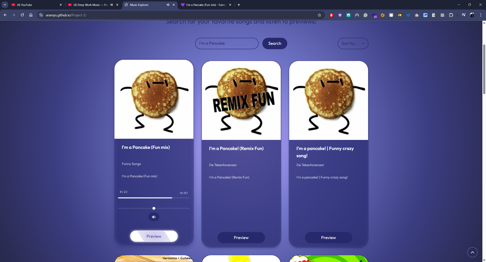

## Table of Contents

### Project Fundamentals

- [📌 Project Overview](#-project-overview)
- [🎵 Project Vision](#-project-vision)
- [💡 Core Concept](#-core-concept)
- [🛠️ Technical Foundation](#️-technical-foundation)

### Project Details

- [🌟 Key Features Highlights](#-key-features-highlights)
- [🎯 Purpose of the Website](#-purpose-of-the-website)
  - [1. Music Discovery](#1-music-discovery)
  - [2. Audio Previewing](#2-audio-previewing)
  - [3. Interactive User Experience](#3-interactive-user-experience)
  - [4. Responsive Access](#4-responsive-access)
  - [5. Visual Customization](#5-visual-customization)

### Design and User Experience

- [🎨 UX Section](#-ux-section)
  - [User Goals](#user-goals)
  - [Developer Goals](#developer-goals)
  - [Design Choices](#design-choices)
- [📝 Wireframes](#-wireframes)
- [📸 Application Screenshots](#-application-screenshots)

### User Interaction

- [👤 User Journey](#-user-journey)
- [🔄 Application Flow](#-application-flow)
- [📋 Features](#-features)

### Technical Specifications

- [🚀 Technologies Stack](#-technologies-stack)
- [📂 Project Structure](#-project-structure)
- [⚙️ Installation and Setup](#️-installation-and-setup)
- [📡 API Reference](#-api-reference)
- [🔒 Security Considerations](#-security-considerations)

### Development and Implementation

- [💻 Code Examples and Implementation](#-code-examples-and-implementation)
- [🧪 Testing Documentation](#-testing-documentation)
- [🌐 Accessibility Compliance](#-accessibility-compliance)
- [🚀 Deployment](#-deployment)
- [🧩 Code Architecture](#-code-architecture)

### Project Management

- [⚠️ Known Limitations and Technical Debt](#️-known-limitations-and-technical-debt)
- [🤝 Contributors](#-contributors)
- [📜 License](#-license)
- [📅 Development Journey](#-development-journey)

# 📌 Music Explorer: Project Overview

Music Explorer is a modern, responsive web application designed to transform how users discover and interact with music. This project demonstrates advanced front-end development techniques while delivering an engaging user experience focused on music discovery and preview.

## 🎵 Project Vision

Music Explorer was created with a vision to combine technical excellence in front-end development with an intuitive, visually appealing music discovery interface. The application serves as both a functional tool for music enthusiasts and a showcase of modern web development practices without relying on external frameworks.

## 💡 Core Concept

At its core, Music Explorer enables users to:

- Search for music across a vast library of artists and tracks
- Preview 30-second audio clips directly in the browser
- Sort and explore results with a responsive, visually engaging interface
- Customize their visual experience with theme options
- Enjoy a consistent experience across all devices and screen sizes

## 🛠️ Technical Foundation

Music Explorer demonstrates technical mastery through:

- **Vanilla JavaScript Architecture**: Building a complex application with pure JavaScript, showcasing advanced patterns without framework dependencies
- **Modern CSS Techniques**: Implementing responsive design using Grid, Flexbox, and CSS variables for theming
- **Audio API Integration**: Creating a custom audio player with progress tracking and volume control
- **API Integration**: Seamlessly connecting with the Deezer music API for real-time data
- **Progressive Enhancement**: Building a solution that works across browsers with graceful fallbacks

## 🌟 Key Features Highlights

### Interactive Music Preview

The application's custom audio player allows users to:

- Play/pause 30-second previews with a single click
- Track playback progress with a visual timeline
- Adjust volume with an intuitive slider
- See currently playing status with visual indicators

### Responsive Design System

Music Explorer adapts fluidly across devices with:

- Mobile-first design approach
- Responsive grid layout that adjusts from single to triple columns
- Touch-optimized controls for mobile users
- Consistent experience from 320px to 1440px+ displays

### Visual Customization

The application features a comprehensive theming system with:

- Toggle between light and dark themes
- Animated theme transitions
- Theme persistence using localStorage
- Consistent color scheme application across all elements

### Intelligent User Interface

The UI focuses on user experience through:

- Clear visual hierarchy and information architecture
- Loading states with animated feedback
- Error handling with user-friendly messages
- Empty state management for first-time users

## 📊 Technical Achievements

Music Explorer represents several technical achievements:

1. **State Management Without Frameworks**: Building a complex application with global state management using pure JavaScript
2. **Custom Audio Controls**: Creating a complete audio player interface from scratch
3. **Responsive Grid System**: Implementing a fluid, content-aware grid that adapts to any screen size
4. **API Integration With Error Handling**: Building robust API communication with comprehensive error management
5. **CSS Variables for Dynamic Theming**: Implementing complete theme switching without JavaScript DOM manipulation

## 👥 User-Centered Design

The application was designed with a focus on user needs:

- **Music Discovery**: Enabling users to find new music quickly and easily
- **Instant Gratification**: Providing immediate audio feedback without leaving the application
- **Visual Clarity**: Presenting track information in a clean, scannable format
- **Preference Adaptation**: Allowing users to customize their experience through theme selection
- **Accessibility Considerations**: Implementing proper semantic markup and focus management

## 🔍 Development Approach

Music Explorer was built using:

- **Modular JavaScript**: Clear separation of concerns with focused components
- **Progressive Enhancement**: Core functionality works without advanced features
- **Mobile-First Design**: Starting with mobile layouts and expanding to larger screens
- **Test-Driven Development**: Comprehensive testing across browsers and devices
- **Iterative Refinement**: Ongoing optimization based on performance testing

## 🔮 Future Vision

While already feature-complete, Music Explorer has potential for expansion:

- **Advanced Filtering**: Adding genre, year, and popularity filters
- **Personalization**: Implementing favorites and history tracking
- **Social Features**: Enabling sharing of discoveries
- **Extended Information**: Adding artist bios and album details
- **Offline Support**: Implementing service workers for offline functionality

## 🏆 Learning Outcomes

This project demonstrates mastery of:

- **Front-End Architecture**: Building complex applications with vanilla JavaScript
- **Modern CSS**: Implementing responsive layouts with Grid and Flexbox
- **Audio Processing**: Managing media playback with the Web Audio API
- **State Management**: Creating a robust state system without external libraries
- **API Integration**: Building resilient connections to third-party services
- **Performance Optimization**: Creating a fast, responsive application experience
- **Cross-Browser Development**: Ensuring compatibility across modern browsers

## 🎨 UX Section

### User Goals

The primary goals for users of the Music Explorer website include:

1. **Effortless Music Searching**

   - Quick access to a search interface for finding favorite songs
   - Immediate display of relevant search results
   - Clear visual representation of track information

2. **Seamless Audio Playback**

   - One-click access to song previews
   - Intuitive audio controls for playback management
   - Real-time progress tracking during playback

3. **Organized Content Exploration**

   - Ability to sort search results by different criteria
   - Clear visual distinction between tracks currently playing and others
   - Responsive grid layout that adapts to different device screens

4. **Visual Preference Customization**

   - Option to switch between dark and light themes
   - Consistent visual experience regardless of chosen theme
   - Smooth transition when switching between themes

5. **Intuitive Navigation**
   - Clear, accessible navigation controls
   - Logical content organization
   - Back-to-top functionality for longer result sets

### Developer Goals

As a developer, the objectives for the website were:

1. **Clean Code Architecture**

   - Modular JavaScript structure with clear separation of concerns
   - Consistent naming conventions and code organization
   - Well-documented functions and code blocks
   - Efficient state management without external libraries

2. **Responsive Design Implementation**

   - Mobile-first approach to ensure compatibility across devices
   - Fluid layouts using CSS Grid and Flexbox
   - Strategic use of media queries for breakpoint management
   - Touch-friendly interface elements for mobile users

3. **Performance Optimization**

   - Efficient DOM manipulation to prevent layout thrashing
   - Optimized event handling with proper event delegation
   - Resource management for audio elements
   - Smooth animations with GPU acceleration where appropriate

4. **API Integration**

   - Clean implementation of Deezer API via RapidAPI
   - Robust error handling for API requests
   - Efficient data processing and display
   - User-friendly loading and error states

5. **User Experience Enhancement**
   - Meaningful animations and transitions
   - Immediate visual feedback for user actions
   - Intuitive control interfaces with proper affordances
   - Consistent design language throughout the application

### Design Choices

#### Fonts

- **Google Fonts - Outfit**: Selected for its clean, modern, and highly legible qualities across different weights. The font works well for both headings and body text, providing a consistent typographic experience.
- **Font Hierarchy**:
  - Headings: 4rem (welcome heading) to 1.2rem (track names)
  - Body text: 1.1rem
  - Secondary text: 0.9rem (artist names, duration)
- **Reasoning**: The Outfit font family provides excellent readability while maintaining a contemporary aesthetic that aligns with the music discovery theme.

#### Icons

- **Font Awesome Icons**: Implemented for interactive elements and status indicators, providing consistent and recognizable visual cues.
- **Custom SVG Icons**: Used for the theme toggle and back-to-top buttons, allowing for theme-specific styling and animation.
- **Reasoning**: Icons enhance the user interface by providing intuitive visual cues for interactive elements, improving usability without cluttering the design.

#### Colors

- **Dark Theme (Default)**:

  - Primary Palette:
    - Purple/Blue Gradient: (#a393eb to #27296d) - Creates an immersive, music-themed environment
    - White Text (#ffffff) - Ensures readability against the dark background
    - Secondary Accent (#5e63b6) - Provides visual hierarchy for interactive elements
  - Background: Radial gradient with subtle pattern overlay for depth

- **Light Theme**:

  - Light Background: Soft white to lavender gradient for a clean, airy feel
  - Dark Text (#27296d) - Maintains readability while connecting to the brand color scheme
  - Secondary Accent (#5e63b6) - Preserves brand identity across themes

- **Reasoning**: The color scheme was chosen to create an immersive, music-focused environment while ensuring accessibility. The purple-blue palette evokes creativity and musical exploration while providing sufficient contrast for text readability.

#### Styling

- **Card Design**: Rounded corners with subtle shadows to create a modern, floating effect
- **Button Styles**: Pill-shaped with hover animations for clear interactive feedback
- **Animations**: Subtle transitions and feedback animations to enhance user experience
- **Reasoning**: These styling choices create visual hierarchy, guide user attention, and provide immediate feedback for interactions.

#### Backgrounds

- **Gradient Backgrounds**: Dynamic radial gradients that create depth and visual interest
- **Pattern Overlay**: Subtle diagonal pattern adds texture without distracting from content
- **Card Backgrounds**: Semi-transparent backgrounds that integrate with the overall design while maintaining readability
- **Reasoning**: The layered background approach creates a visually engaging environment that remains subtle enough not to compete with the primary content.

## 📝 Wireframes

The wireframes were created during the planning stage to guide the website's structure and layout across different device sizes.

### Desktop View


- Full navigation bar with theme toggle
- Search and sort controls
- Three-column track grid layout
- Audio controls within each track card

### Tablet View


- Adjusted navigation for medium screens
- Two-column track grid layout
- Optimized search and sort positioning
- Maintained audio control accessibility

### Mobile View


- Hamburger menu for navigation
- Single-column track layout
- Stacked search and sort controls
- Touch-optimized playback interface

### Design Evolution:

- Initial wireframes focused on basic layout structure
- The design evolved to incorporate more immersive background elements
- Audio controls were enhanced beyond initial plans based on testing feedback
- Animation and transition effects were added incrementally during development

## 📸 Application Screenshots

The following screenshots showcase key interfaces and functionality of Music Explorer across different themes and devices.

### Core User Interface

#### Welcome Screen (Dark Theme)


_The initial welcome screen invites users to search for music with a clean, focused interface featuring the application's primary branding and search prompt._

#### Search Results (Dark Theme)


_Search results are displayed in a responsive grid layout with clear artist information, track details, and album name._

### Playing State

#### Track Playback (Dark Theme)


_When a track is playing, visual indicators highlight the active card, and playback controls appear with progress tracking and volume adjustment._

### Theme Variants

#### Welcome Screen (Light Theme)


_The light theme maintains the same functionality with a brighter color palette that maintains excellent contrast and readability._

#### Search Results (Light Theme)


_Search results in light theme demonstrate the consistent experience across theme preferences._

#### Track Playback (Light Theme)


_When a track is playing, visual indicators highlight the active card, and playback controls appear with progress tracking and volume adjustment._

### Mobile Experience

#### Mobile Search Results


_On mobile devices, the layout adapts to a single-column design that maximizes screen space while maintaining all functionality._

#### Mobile Playback


_Mobile playback controls are optimized for touch interaction with larger tap targets and streamlined controls._

### Interactive Elements

#### Sorting Controls


_The custom-styled sorting dropdown allows users to organize results by title, artist, or duration._

#### Volume Controls


_Intuitive volume slider with mute option provides granular control over audio playback levels._

#### Error State


_Clear error messaging guides users when issues occur during searches or API requests._

---

## 👤 User Journey

The Music Explorer application is designed to provide an intuitive and engaging user experience from first visit to regular usage. This section maps the complete user journey through the application, highlighting key touchpoints, interactions, and emotional responses.

### First-Time Visitor Journey

#### 1. Discovery & Landing Experience

**User Actions:**

- Arrives at Music Explorer welcome screen
- Observes the welcome message and search prompt
- Takes in the visual design and branding

**Touchpoints:**

- Welcome screen with animated introduction
- Clear search call-to-action
- Theme toggle option in navigation
- Clean, music-focused design aesthetic

**User Thoughts:**

> _"This looks interesting. The design is modern and focused on music discovery. Let me try searching for something."_

**System Response:**

- Displays welcoming introduction text
- Shows prominent search bar
- Presents default dark theme (or previously saved theme)
- Navigation items are visible and accessible


_The welcoming screen provides immediate context and clear direction for new users._

#### 2. Initial Search Interaction

**User Actions:**

- Enters a favorite artist or song in the search field
- Submits the search query
- Waits for results to appear

**Touchpoints:**

- Responsive search input field
- Submit button with clear visual feedback
- Loading animation during search process

**User Thoughts:**

> _"I'll search for my favorite band. The search bar is easy to find and use. I can see something is happening while it searches."_

**System Response:**

- Shows animated loading spinner during API request
- Transitions smoothly from welcome screen to results view
- Displays search results in visual card format
- Shows sort options for result organization


_Search results appear in a clean, visually organized grid with clear artist and track information._

#### 3. Results Exploration

**User Actions:**

- Scans the search results grid
- Reads track titles and artist information
- Hovers over cards to see interactive elements
- Scrolls through multiple results

**Touchpoints:**

- Responsive grid layout of track cards
- Clear track and artist information
- Hover effects on cards signaling interactivity
- Preview buttons for audio playback

**User Thoughts:**

> _"I can easily see all the tracks by this artist. The cards show the album artwork which helps me recognize songs. The layout adjusts nicely as I resize my browser."_

**System Response:**

- Displays results in responsive grid (3 columns on desktop, 2 on tablet, 1 on mobile)
- Shows album art, track title, artist name, and duration
- Provides visual feedback on card hover
- Maintains consistent spacing and alignment

#### 4. First Audio Preview

**User Actions:**

- Clicks on a track card or preview button
- Listens to audio preview
- Observes playback controls
- Potentially adjusts volume

**Touchpoints:**

- Play/pause button with clear state indication
- Progress bar showing playback position
- Time display showing elapsed/total time
- Volume control slider

**User Thoughts:**

> _"I can listen to a preview right here without leaving the site. The controls are intuitive, and I can see how much of the preview I've heard."_

**System Response:**

- Initiates audio playback with brief loading state if needed
- Displays progress bar that updates in real time
- Shows current playing status with visual indicators
- Provides volume adjustment capability


_When a track is playing, visual indicators and playback controls provide an interactive experience._

#### 5. Visual Customization

**User Actions:**

- Notices theme toggle in navigation
- Clicks to switch between dark and light themes
- Observes visual transformation

**Touchpoints:**

- Theme toggle button with clear icon
- Smooth transition animation between themes
- Consistent functionality across themes

**User Thoughts:**

> _"I prefer a lighter interface during the day. It's nice that I can switch so easily, and everything still works the same way."_

**System Response:**

- Smoothly transitions all colors and visual elements
- Maintains functionality and layout during theme change
- Updates toggle icon to reflect current theme
- Preserves theme preference for future visits


_The light theme offers an alternative visual experience while maintaining the same functionality._

### Returning Visitor Journey

Returning visitors experience a streamlined journey that builds on their previous interactions with Music Explorer.

#### 1. Recognition & Continuation

**User Actions:**

- Returns to Music Explorer after previous visit
- Recognizes the interface and functionality
- May see their preferred theme automatically applied

**Touchpoints:**

- Consistent interface from previous visits
- Preserved theme preference from localStorage
- Familiar search functionality

**User Thoughts:**

> _"I'm back to find some new music. The site remembered my light theme preference, which is convenient."_

**System Response:**

- Loads with previously saved theme preference
- Presents familiar welcome screen or recent search results
- Maintains consistent navigation and interface elements

#### 2. Advanced Search & Exploration

**User Actions:**

- Performs more specific or varied searches
- Tries different artists or song titles
- May search for genres or specific tracks

**Touchpoints:**

- Search form with clear interaction history
- Responsive feedback for different query types
- Consistent results presentation

**User Thoughts:**

> _"I'm getting more comfortable with how the search works. I can quickly find different artists and compare their tracks."_

**System Response:**

- Processes various search queries efficiently
- Displays appropriate results for different search types
- Handles edge cases like zero results gracefully
- Provides consistent performance across search variations

#### 3. Results Organization

**User Actions:**

- Discovers and utilizes sort functionality
- Orders results by different criteria
- Observes reorganization of track cards

**Touchpoints:**

- Sort dropdown with clear options
- Immediate visual feedback when sorting
- Maintained playback state during sorting

**User Thoughts:**

> _"I can organize these tracks by duration to find shorter previews, or alphabetically to locate specific tracks more easily."_

**System Response:**

- Applies selected sorting criteria immediately
- Preserves any currently playing track during sort
- Maintains consistent card layout during reordering
- Provides smooth animation during sort transitions


_The sorting dropdown allows users to organize results by title, artist, or duration while maintaining playback state._

#### 4. Multi-Track Exploration

**User Actions:**

- Plays multiple tracks in succession
- Compares different songs by the same or different artists
- Switches between tracks during playback

**Touchpoints:**

- Seamless transition between tracks
- Clear indication of currently playing track
- Consistent control locations across tracks

**User Thoughts:**

> _"I can easily preview different tracks to compare them. The system clearly shows which track is currently playing."_

**System Response:**

- Stops previous track when new track is selected
- Updates visual playing state on appropriate card
- Maintains volume settings between tracks
- Provides consistent loading states during transitions

#### 5. Volume Control Utilization

**User Actions:**

- Discovers and utilizes volume controls
- Adjusts playback volume to preferred level
- May mute/unmute audio during playback

**Touchpoints:**

- Intuitive volume slider control
- Mute button with clear state indication
- Persistent volume settings between tracks

**User Thoughts:**

> _"I appreciate being able to adjust the volume right here instead of using my system volume. The mute button is helpful when I need to quickly silence playback."_

**System Response:**

- Adjusts audio volume in real time
- Provides visual feedback on volume level
- Preserves volume settings for subsequent tracks
- Shows appropriate icon states for mute/unmute


_Custom volume controls provide an intuitive way to adjust audio playback levels with immediate feedback._

### Mobile User Journey

The mobile experience is optimized for touch interaction and smaller screens while maintaining core functionality.

#### 1. Mobile Landing & Navigation

**User Actions:**

- Accesses Music Explorer on a mobile device
- Observes compact mobile layout
- Uses hamburger menu for navigation

**Touchpoints:**

- Responsive layout optimized for mobile viewport
- Touch-friendly hamburger menu
- Accessible theme toggle in mobile navigation

**User Thoughts:**

> _"The mobile version adapts well to my phone screen. I can still access all the features through the menu."_

**System Response:**

- Presents single-column layout optimized for mobile
- Provides touch-friendly navigation through hamburger menu
- Maintains consistent branding and functionality
- Offers appropriate touch target sizes for all interactive elements

#### 2. Mobile Search & Results

**User Actions:**

- Uses mobile-optimized search input
- Submits search with touch keyboard
- Scrolls through vertical results list

**Touchpoints:**

- Full-width search input
- Touch-optimized submit button
- Single-column results grid for mobile

**User Thoughts:**

> _"The search works well on my phone. I can easily scroll through results in this vertical layout."_

**System Response:**

- Adapts search form for touch input
- Handles mobile keyboard interactions appropriately
- Presents results in a single column for easy scrolling
- Maintains proper touch target sizes for all interactions


_The responsive design adapts seamlessly to mobile devices with a single-column layout optimized for touch._

#### 3. Mobile Playback Experience

**User Actions:**

- Taps track card to play audio
- Uses touch-optimized controls
- Scrolls while maintaining playback

**Touchpoints:**

- Large touch targets for play/pause
- Touch-friendly progress and volume sliders
- Persistent playback during navigation

**User Thoughts:**

> _"The touch controls are easy to use with my thumb. I can continue listening while browsing other results."_

**System Response:**

- Provides larger touch areas for all controls
- Maintains playback state during scrolling
- Optimizes slider controls for touch interaction
- Presents clear visual feedback for touch actions


_Playback controls are optimized for touch interaction on mobile devices with larger tap targets._

### Error Handling Experience

Users occasionally encounter errors, and Music Explorer provides a supportive experience during these moments.

#### 1. Search Error Handling

**User Actions:**

- Submits empty search
- Experiences API connection issue
- Receives no results for a search

**Touchpoints:**

- Clear error messaging
- Guidance for resolution
- Easy dismissal of error notices

**User Thoughts:**

> _"I understand what went wrong and how to fix it. The error message is clear and not technical jargon."_

**System Response:**

- Displays user-friendly error message
- Provides specific guidance based on error type
- Automatically dismisses errors after appropriate time
- Allows manual dismissal of error messages


_Clear error messaging guides users when issues occur during searches or playback._

#### 2. Playback Error Recovery

**User Actions:**

- Encounters track that won't play
- Sees playback error message
- Attempts to play different track

**Touchpoints:**

- Clear playback error indication
- Easy transition to alternative tracks
- Maintained overall application functionality

**User Thoughts:**

> _"This track won't play, but I understand why and can easily try another one. The whole application didn't break just because of one error."_

**System Response:**

- Indicates specific track playback issues
- Maintains functionality of other tracks
- Provides clear visual error state on problematic track
- Allows seamless transition to other content

### User Journey Map

This visual journey map illustrates the user's emotional experience throughout their interaction with Music Explorer:

```
     Emotional      │
     Response       │                                        ⬆️
                    │                                       /
     Highly         │                                 🔊  /
     Positive       │                             🎵    /
                    │                         🎧      /
                    │                       /       /
     Positive       │            📱     _ /       /
                    │          /   \_ /         /
                    │        /               _/
     Neutral        │───────/────────────_/─────────────────────────► Time
                    │     /         ⚠️
                    │   /
     Negative       │ /
                    │
                    │
     Key:  🎵 First audio playback   🔊 Volume control discovery
           📱 Mobile adaptation      🎧 Multi-track comparison
           ⚠️ Error recovery
```

This journey map demonstrates how the user experience generally improves as users discover more features and functionality, with brief dips during error states that quickly recover.

### Journey Touchpoint Summary

| Journey Stage        | Desktop Touchpoints                      | Mobile Touchpoints                      | Emotional Response             |
| -------------------- | ---------------------------------------- | --------------------------------------- | ------------------------------ |
| Initial Visit        | Welcome screen, theme toggle, search bar | Compact welcome screen, hamburger menu  | Curious, exploratory           |
| First Search         | Loading animation, results grid          | Loading animation, vertical results     | Interested, engaged            |
| First Playback       | Play button, progress bar, album art     | Touch play, mobile-optimized controls   | Delighted, surprised           |
| Theme Customization  | Theme toggle, visual transition          | Theme toggle in menu, visual transition | Satisfied, in control          |
| Results Organization | Sort dropdown, reorganized grid          | Sort dropdown, reorganized list         | Empowered, efficient           |
| Error Handling       | Error message, clear guidance            | Mobile-optimized error display          | Brief frustration, then relief |
| Return Visit         | Remembered preferences, familiar layout  | Consistent mobile experience            | Comfortable, confident         |

By understanding this comprehensive user journey, Music Explorer can continue to evolve with user needs in mind, enhancing touchpoints that create positive emotional responses and smoothing any pain points in the experience.

## 🔄 Application Flow

This section details the core functionality and user interaction patterns of Music Explorer, illustrating how different components interact to create a cohesive user experience.

### Core Application Flow

The following diagram illustrates the primary user flow and data processing path:

```
┌─────────────────┐     ┌─────────────────┐     ┌─────────────────┐
│                 │     │                 │     │                 │
│  Initial Load   │────►│  Search Input   │────►│  API Request    │
│                 │     │                 │     │                 │
└─────────────────┘     └─────────────────┘     └────────┬────────┘
                                                         │
                                                         ▼
┌─────────────────┐     ┌─────────────────┐     ┌─────────────────┐
│                 │     │                 │     │                 │
│  User Playback  │◄────│  Display Results│◄────│  Process Data   │
│                 │     │                 │     │                 │
└────────┬────────┘     └─────────────────┘     └─────────────────┘
         │
         ▼
┌─────────────────┐     ┌─────────────────┐
│                 │     │                 │
│  Audio Controls │────►│  Sort Results   │
│                 │     │                 │
└─────────────────┘     └─────────────────┘
```

### Detailed Process Flows

#### 1. Initialization Flow

When the application first loads, the following sequence occurs:

```
┌─────────────────┐
│  DOM Content    │
│    Loaded       │
└────────┬────────┘
         │
         ▼
┌─────────────────┐
│  Initialize     │
│  Event Listeners│
└────────┬────────┘
         │
         ▼
┌─────────────────┐
│  Check Local    │
│  Storage        │
└────────┬────────┘
         │
         ▼
┌─────────────────┐
│  Apply Saved    │
│  Theme          │
└────────┬────────┘
         │
         ▼
┌─────────────────┐
│  Display Welcome│
│  Screen         │
└─────────────────┘
```

**Key Implementation:**

```javascript
document.addEventListener("DOMContentLoaded", () => {
  // Initialize event listeners
  setupEventListeners();

  // Load saved theme from localStorage
  initializeTheme();

  // Show welcome screen
  displayWelcomeScreen();
});

function initializeTheme() {
  const savedTheme = localStorage.getItem("theme");

  if (savedTheme === "light") {
    document.documentElement.setAttribute("data-theme", "light");
    document.querySelector(".theme-toggle").innerHTML = '<i class="fas fa-moon"></i>';
  } else {
    document.documentElement.removeAttribute("data-theme");
    document.querySelector(".theme-toggle").innerHTML = '<i class="fas fa-sun"></i>';
  }
}
```

#### 2. Search and Results Flow

When a user performs a search, this sequence processes the request and displays results:

```
┌─────────────────┐
│  User Submits   │
│  Search         │
└────────┬────────┘
         │
         ▼
┌─────────────────┐
│  Show Loading   │
│  Indicator      │
└────────┬────────┘
         │
         ▼
┌─────────────────┐
│  Call API       │
│  (musicAPI)     │
└────────┬────────┘
         │
         ▼
┌─────────────────┐     ┌─────────────────┐
│                 │     │                 │
│  API Success?   │─No─►│  Show Error     │
│                 │     │  Message        │
└────────┬────────┘     └─────────────────┘
         │ Yes
         ▼
┌─────────────────┐     ┌─────────────────┐
│                 │     │                 │
│ Results Found?  │─No─►│  Show "No       │
│                 │     │  Results" Message│
└────────┬────────┘     └─────────────────┘
         │ Yes
         ▼
┌─────────────────┐
│  Hide Loading   │
│  Indicator      │
└────────┬────────┘
         │
         ▼
┌─────────────────┐
│  Create Track   │
│  Cards          │
└────────┬────────┘
         │
         ▼
┌─────────────────┐
│  Show Results   │
│  Grid           │
└────────┬────────┘
         │
         ▼
┌─────────────────┐
│  Show Sort      │
│  Options        │
└─────────────────┘
```

**Key Implementation:**

```javascript
searchForm.addEventListener("submit", async (e) => {
  e.preventDefault();
  const query = searchInput.value.trim();

  if (!query) {
    showError("Please enter a search term");
    return;
  }

  // Show loading state
  showLoading();

  try {
    // API request
    const tracks = await musicAPI.searchTracks(query);

    // Check if results exist
    if (!tracks || tracks.length === 0) {
      hideLoading();
      showNoResultsMessage(query);
      return;
    }

    // Process and display results
    currentTracks = [...tracks];
    hideLoading();
    renderTracks(tracks);
    showSortOptions();
  } catch (error) {
    hideLoading();
    handleApiError(error);
  }
});
```

#### 3. Audio Playback Flow

When a user interacts with track playback, the following sequence occurs:

```
┌─────────────────┐
│  User Clicks    │
│  Track          │
└────────┬────────┘
         │
         ▼
┌─────────────────┐     ┌─────────────────┐
│  Is Track       │     │                 │
│  Currently      │─Yes─►  Pause Track    │
│  Playing?       │     │                 │
└────────┬────────┘     └─────────────────┘
         │ No
         ▼
┌─────────────────┐     ┌─────────────────┐
│  Other Track    │     │  Stop Current   │
│  Playing?       │─Yes─►  Track          │
│                 │     │                 │
└────────┬────────┘     └────────┬────────┘
         │ No                   │
         ▼                      │
┌─────────────────┐             │
│  Show Loading   │◄────────────┘
│  State          │
└────────┬────────┘
         │
         ▼
┌─────────────────┐
│  Load Audio     │
│  Preview        │
└────────┬────────┘
         │
         ▼
┌─────────────────┐     ┌─────────────────┐
│                 │     │  Show Error     │
│  Load Success?  │─No─►│  Message        │
│                 │     │                 │
└────────┬────────┘     └─────────────────┘
         │ Yes
         ▼
┌─────────────────┐
│  Start          │
│  Playback       │
└────────┬────────┘
         │
         ▼
┌─────────────────┐
│  Show Progress  │
│  & Controls     │
└────────┬────────┘
         │
         ▼
┌─────────────────┐
│  Update UI      │
│  To Playing     │
└────────┬────────┘
         │
         ▼
┌─────────────────┐
│  Track          │
│  Completes      │
└────────┬────────┘
         │
         ▼
┌─────────────────┐
│  Reset UI       │
│  To Default     │
└─────────────────┘
```

**Key Implementation:**

```javascript
async function handlePlayback(card, previewUrl) {
  // If already playing this track, pause it
  if (currentlyPlaying && currentlyPlaying.card === card) {
    currentlyPlaying.audio.pause();
    updateUIState(card, UIStates.IDLE);
    currentlyPlaying = null;
    return;
  }

  // Stop any currently playing track
  if (currentlyPlaying) {
    currentlyPlaying.audio.pause();
    updateUIState(currentlyPlaying.card, UIStates.IDLE);
  }

  // Start loading indicator with delay
  let loadingTimeout = setTimeout(() => {
    updateUIState(card, UIStates.LOADING);
  }, 200);

  try {
    // Create and play new audio
    const audio = new Audio(previewUrl);

    // Set up UI elements
    const progressContainer = createProgressContainer();
    const volumeControl = createVolumeControl(audio);

    // Wait for metadata before playing
    await new Promise((resolve) => {
      audio.addEventListener("loadedmetadata", resolve);
      setTimeout(resolve, 3000); // Timeout fallback
    });

    // Start playback
    await audio.play();
    clearTimeout(loadingTimeout);

    // Update global state
    currentlyPlaying = {
      audio,
      card,
      progressContainer,
      volumeControl,
    };

    // Update UI to playing state
    updateUIState(card, UIStates.PLAYING);

    // Set up audio events
    setupAudioEvents(audio, card);
  } catch (error) {
    clearTimeout(loadingTimeout);
    console.error("Playback error:", error);
    updateUIState(card, UIStates.ERROR);
  }
}
```

#### 4. Theme Switching Flow

When a user changes the application theme:

```
┌─────────────────┐
│  User Clicks    │
│  Theme Toggle   │
└────────┬────────┘
         │
         ▼
┌─────────────────┐
│  Check Current  │
│  Theme          │
└────────┬────────┘
         │
         ▼
┌─────────────────┐     ┌─────────────────┐
│                 │     │  Apply Light    │
│  Is Dark Theme? │─Yes─►  Theme          │
│                 │     │                 │
└────────┬────────┘     └────────┬────────┘
         │ No                   │
         ▼                      │
┌─────────────────┐             │
│  Apply Dark     │◄────────────┘
│  Theme          │
└────────┬────────┘
         │
         ▼
┌─────────────────┐
│  Update Toggle  │
│  Icon           │
└────────┬────────┘
         │
         ▼
┌─────────────────┐
│  Save Preference│
│  To LocalStorage│
└────────┬────────┘
         │
         ▼
┌─────────────────┐
│  Apply Toggle   │
│  Animation      │
└─────────────────┘
```

**Key Implementation:**

```javascript
function toggleTheme() {
  const root = document.documentElement;
  const themeToggle = document.querySelector(".theme-toggle");

  // Check current theme
  const isDarkTheme = !root.hasAttribute("data-theme");

  if (isDarkTheme) {
    // Switch to light theme
    root.setAttribute("data-theme", "light");
    themeToggle.innerHTML = '<i class="fas fa-moon"></i>';
    localStorage.setItem("theme", "light");
  } else {
    // Switch to dark theme
    root.removeAttribute("data-theme");
    themeToggle.innerHTML = '<i class="fas fa-sun"></i>';
    localStorage.setItem("theme", "dark");
  }

  // Add animation class
  themeToggle.classList.add("theme-toggle-animation");

  // Remove animation class after animation completes
  setTimeout(() => {
    themeToggle.classList.remove("theme-toggle-animation");
  }, 1000);
}
```

#### 5. Results Sorting Flow

When a user sorts search results:

```
┌─────────────────┐
│  User Selects   │
│  Sort Option    │
└────────┬────────┘
         │
         ▼
┌─────────────────┐     ┌─────────────────┐
│                 │     │                 │
│  Default Sort?  │─Yes─►  Restore        │
│                 │     │  Original Order │
└────────┬────────┘     └─────────────────┘
         │ No
         ▼
┌─────────────────┐
│  Clone Current  │
│  Track Data     │
└────────┬────────┘
         │
         ▼
┌─────────────────┐
│  Apply Selected │
│  Sort Logic     │
└────────┬────────┘
         │
         ▼
┌─────────────────┐
│  Save State of  │
│  Playing Track  │
└────────┬────────┘
         │
         ▼
┌─────────────────┐
│  Recreate       │
│  Track Cards    │
└────────┬────────┘
         │
         ▼
┌─────────────────┐
│  Restore        │
│  Playing State  │
└─────────────────┘
```

**Key Implementation:**

```javascript
sortSelect.addEventListener("change", () => {
  const sortType = sortSelect.value;

  if (sortType === "default") {
    renderTracks(currentTracks);
    return;
  }

  // Create a copy for sorting to avoid modifying original data
  const sortedTracks = [...currentTracks];

  // Apply sorting based on selected type
  sortedTracks.sort((a, b) => {
    switch (sortType) {
      case "title":
        return a.title.localeCompare(b.title);
      case "artist":
        return a.artist.name.localeCompare(b.artist.name);
      case "duration":
        return a.duration - b.duration;
      default:
        return 0;
    }
  });

  // Remember currently playing track
  const playingTrackId = currentlyPlaying?.card?.dataset.trackId;

  // Render sorted tracks
  renderTracks(sortedTracks);

  // Restore playing state if applicable
  if (playingTrackId && currentlyPlaying) {
    const newCard = document.querySelector(`.track-card[data-track-id="${playingTrackId}"]`);
    if (newCard) {
      newCard.classList.add("playing");
      currentlyPlaying.card = newCard;
    }
  }
});
```

### State Management Flow

The application maintains several key state objects that influence UI presentation and behavior:

```
┌───────────────────────────────────────────────────────┐
│                                                       │
│                  Application State                    │
│                                                       │
├───────────────┬───────────────────┬───────────────────┤
│               │                   │                   │
│  Theme State  │  Search State     │  Playback State   │
│               │                   │                   │
│ ┌───────────┐ │ ┌───────────────┐ │ ┌───────────────┐ │
│ │ Dark/Light│ │ │ Query String  │ │ │ Current Track │ │
│ └───────────┘ │ └───────────────┘ │ └───────────────┘ │
│               │                   │                   │
│               │ ┌───────────────┐ │ ┌───────────────┐ │
│               │ │ Loading Status│ │ │ Playing Status│ │
│               │ └───────────────┘ │ └───────────────┘ │
│               │                   │                   │
│               │ ┌───────────────┐ │ ┌───────────────┐ │
│               │ │ Search Results│ │ │ Volume Level  │ │
│               │ └───────────────┘ │ └───────────────┘ │
│               │                   │                   │
│               │ ┌───────────────┐ │ ┌───────────────┐ │
│               │ │ Sort Order    │ │ │ Progress      │ │
│               │ └───────────────┘ │ └───────────────┘ │
│               │                   │                   │
└───────────────┴───────────────────┴───────────────────┘
```

**Key Global State Variables:**

```javascript
// Global state for currently playing audio
let currentlyPlaying = null;

// Global state for current track data
let currentTracks = [];

// Error message display timeout reference
let errorTimeout = null;

// UI States enum
const UIStates = {
  IDLE: "idle",
  LOADING: "loading",
  PLAYING: "playing",
  ERROR: "error",
};
```

### Event Flow

The application uses an event-based architecture for many interactions:

```
┌─────────────────┐
│                 │
│  DOM Events     │
│                 │
├─────────────────┤
│ - click         │
│ - submit        │
│ - change        │
│ - scroll        │
└────────┬────────┘
         │
         ▼
┌─────────────────┐
│                 │
│  Audio Events   │
│                 │
├─────────────────┤
│ - play          │
│ - pause         │
│ - timeupdate    │
│ - ended         │
│ - error         │
└────────┬────────┘
         │
         ▼
┌─────────────────┐
│                 │
│ Event Handlers  │
│                 │
├─────────────────┤
│ - handlePlay    │
│ - handleSearch  │
│ - handleSort    │
│ - handleTheme   │
└────────┬────────┘
         │
         ▼
┌─────────────────┐
│                 │
│  State Updates  │
│                 │
├─────────────────┤
│ - updateUIState │
│ - updateProgress│
│ - showLoading   │
└────────┬────────┘
         │
         ▼
┌─────────────────┐
│                 │
│   DOM Updates   │
│                 │
├─────────────────┤
│ - classList     │
│ - innerHTML     │
│ - createElement │
└─────────────────┘
```

**Key Event Bindings:**

```javascript
function setupEventListeners() {
  // Search form submission
  searchForm.addEventListener("submit", handleSearch);

  // Theme toggle
  document.querySelector(".theme-toggle").addEventListener("click", toggleTheme);

  // Sort selection
  document.getElementById("sort-select").addEventListener("change", handleSort);

  // Back to top button
  document.querySelector(".back-to-top").addEventListener("click", scrollToTop);

  // Mobile menu toggle
  document.querySelector(".menu-toggle").addEventListener("click", toggleMobileMenu);

  // Results grid for delegate event handling
  resultsGrid.addEventListener("click", handleTrackInteraction);

  // Window scroll event for showing/hiding back to top button
  window.addEventListener("scroll", handleScroll);
}
```

### User Interaction Points

This diagram highlights the primary interaction points throughout the application:

```
┌───────────────────────────────────────────────────────┐
│                                                       │
│                   Music Explorer                      │
│                                                       │
├───────────────┬───────────────────┬───────────────────┤
│               │                   │                   │
│    Header     │  Search Section   │  Results Grid     │
│               │                   │                   │
├───────────────┼───────────────────┼───────────────────┤
│ ┌───────────┐ │ ┌───────────────┐ │ ┌───────────────┐ │
│ │Theme Toggle│ │ │Search Input   │ │ │Track Cards    │ │
│ └───────────┘ │ └───────────────┘ │ └───────────────┘ │
│               │                   │                   │
│ ┌───────────┐ │ ┌───────────────┐ │ ┌───────────────┐ │
│ │Navigation │ │ │Search Button  │ │ │Play/Pause     │ │
│ └───────────┘ │ └───────────────┘ │ └───────────────┘ │
│               │                   │                   │
│               │ ┌───────────────┐ │ ┌───────────────┐ │
│               │ │Sort Dropdown  │ │ │Progress Bar   │ │
│               │ └───────────────┘ │ └───────────────┘ │
│               │                   │                   │
│               │                   │ ┌───────────────┐ │
│               │                   │ │Volume Control │ │
│               │                   │ └───────────────┘ │
│               │                   │                   │
└───────────────┴───────────────────┴───────────────────┘
                                    │
                                    ▼
┌───────────────────────────────────────────────────────┐
│                                                       │
│                   Footer Section                      │
│                                                       │
├───────────────────────────────────────────────────────┤
│ ┌───────────────────┐         ┌───────────────────┐   │
│ │Copyright Info     │         │Back to Top Button │   │
│ └───────────────────┘         └───────────────────┘   │
│                                                       │
└───────────────────────────────────────────────────────┘
```

### Error Handling Flow

The application implements comprehensive error handling throughout the user flow:

```
┌─────────────────┐
│                 │
│  Error Source   │
│                 │
├─────────────────┤
│ - API Error     │
│ - Empty Search  │
│ - Playback Error│
│ - No Results    │
└────────┬────────┘
         │
         ▼
┌─────────────────┐
│                 │
│  Error Logging  │
│                 │
├─────────────────┤
│ - Console Error │
│ - Error Details │
└────────┬────────┘
         │
         ▼
┌─────────────────┐
│                 │
│  Error Analysis │
│                 │
├─────────────────┤
│ - Error Type    │
│ - User Impact   │
└────────┬────────┘
         │
         ▼
┌─────────────────┐
│                 │
│ User Messaging  │
│                 │
├─────────────────┤
│ - Error Display │
│ - User Guidance │
└────────┬────────┘
         │
         ▼
┌─────────────────┐
│                 │
│ Auto-Dismissal  │
│                 │
├─────────────────┤
│ - Timeout       │
│ - Manual Close  │
└────────┬────────┘
         │
         ▼
┌─────────────────┐
│                 │
│  Recovery       │
│                 │
├─────────────────┤
│ - State Reset   │
│ - Ready for New │
│   Interaction   │
└─────────────────┘
```

**Key Error Handling Implementation:**

```javascript
function handleApiError(error) {
  console.error("API Error:", error);

  // Determine error type for appropriate messaging
  if (error.message.includes("429")) {
    showError("Too many requests. Please try again later.", 8000);
  } else if (error.message.includes("Network") || error.message.includes("Failed to fetch")) {
    showError("Network error. Please check your connection.", 8000);
  } else {
    showError("Something went wrong. Please try again later.", 5000);
  }
}

function showError(message, duration = 5000) {
  const errorContainer = document.getElementById("error-container");
  const errorText = document.getElementById("error-text");

  // Clear any existing timeout
  if (errorTimeout) {
    clearTimeout(errorTimeout);
  }

  // Set error message
  errorText.textContent = message;

  // Show error container
  errorContainer.classList.remove("hidden");

  // Automatically hide after duration
  errorTimeout = setTimeout(() => {
    errorContainer.classList.add("hidden");
  }, duration);

  // Allow manual dismissal
  const dismissButton = document.getElementById("error-dismiss");
  dismissButton.addEventListener(
    "click",
    () => {
      errorContainer.classList.add("hidden");
      clearTimeout(errorTimeout);
    },
    { once: true }
  );
}
```

By visualizing and documenting these core application flows, developers can better understand the architecture, behavior, and interaction patterns within Music Explorer.

## 📋 Features

### 🔎 Search and Discovery

- ✅ **Intuitive Search Interface**: Clean, prominent search form with instant feedback
- ✅ **Loading Indicator**: Animated spinner during search operations
- ✅ **Error Handling**: User-friendly error messages with auto-dismissal
- ✅ **Empty State Management**: Welcoming initial screen for first-time visitors
- ✅ **Results Management**: Dynamic grid system with adaptive layout
- ✅ **Sort Functionality**: Ability to sort results by title, artist, or duration

### 🎧 Audio Playback

- ✅ **Preview Player**: One-click preview playback for search results
- ✅ **Progress Tracking**: Visual progress bar with time display
- ✅ **Volume Control**: Adjustable volume with mute/unmute option
- ✅ **Multi-Track Management**: Proper handling when switching between tracks
- ✅ **Visual Feedback**: Animated playing status indicators

### 🎨 User Interface

- ✅ **Responsive Design**: Seamless experience from 320px mobile to 1440px+ desktop displays
- ✅ **Theme Customization**: Toggle between dark and light themes with smooth transitions
- ✅ **Touch-Friendly Controls**: Optimized interface for mobile use
- ✅ **Visual Hierarchy**: Clear distinction between tracks and currently playing content
- ✅ **Animation System**: Subtle transitions for user interactions

### 📱 Mobile Experience

- ✅ **Hamburger Menu**: Touch-friendly navigation for smaller screens
- ✅ **Optimized Controls**: Larger touch targets for mobile interaction
- ✅ **Fluid Adaptation**: Dynamic layout adjustments for various screen sizes

### 🧩 Technical Implementation

- ✅ **Modular JavaScript**: Clean separation of concerns with focused components
- ✅ **API Integration**: Efficient data fetching with error handling
- ✅ **State Management**: Robust playback state tracking across user interactions
- ✅ **Memory Optimization**: Proper audio resource cleanup to prevent leaks

### 📝 Planned Enhancements

- 📝 **Advanced search filters**: Filter by genre, popularity, release date
- 📝 **Keyboard shortcuts**: Improved accessibility through keyboard navigation
- 📝 **Personal favorites**: Save tracks for later listening
- 📝 **Social sharing**: Share discoveries with others
- 📝 **Offline mode**: Limited functionality when connection is lost

## 🚀 Technologies Stack

### Core Technologies

- **HTML5**: Semantic markup for content structure and accessibility
- **CSS3**: Modern styling with custom properties, flexbox, and grid layouts
- **JavaScript**: ES6+ features for interactive functionality

### API Integration

- **Deezer API**: Music data source accessed via RapidAPI
- **RapidAPI**: API proxy service for secure third-party API access

### UI Components

- **Google Fonts**: Typography with Outfit font family
- **Font Awesome**: Vector icons for enhanced interface elements
- **Normalize.css**: Cross-browser styling baseline

### Development Tools

- **Visual Studio Code**: Primary development environment
- **Git & GitHub**: Version control and code hosting
- **Live Server**: Local development server for testing

### Testing Tools

- **Chrome DevTools**: Performance profiling and debugging
- **Lighthouse**: Automated performance, accessibility, and SEO auditing
- **WAVE**: Web accessibility evaluation tool
- **W3C Validators**: HTML and CSS validation

## 📂 Project Structure

```
Music Explorer/
│
├── index.html                 # Main HTML document
├── css/
│   └── style.css              # Main stylesheet with all styles
│
├── js/
│   ├── api.js                 # API integration module
│   └── main.js                # Core application logic
│
├── assets/
│   ├── images/                # Project images and icons
│   │   ├── wireframes/        # Project wireframes
│   │   └── testing/           # Testing screenshots
│   └── favicon/               # Favicon files
│
└── README.md                  # Project documentation
```

## ⚙️ Installation and Setup

Follow these step-by-step instructions to set up the Music Explorer project for local development or deployment.

### Prerequisites

- **Web Browser**: Chrome, Firefox, Safari, or Edge (latest versions recommended)
- **Code Editor**: Visual Studio Code, Sublime Text, or similar
- **API Access**: RapidAPI account for Deezer API access
- **Git**: For version control (optional for download-only installation)

### Option 1: Quick Start (No API Key Required)

If you just want to explore the application without full API functionality:

1. **Download or Clone the Repository**

   ```bash
   git clone https://github.com/aransys/Project-2.git
   # OR download ZIP from GitHub and extract
   ```

2. **Open the Project**
   - Navigate to the project folder
   - Open `index.html` in your browser
   - Note: Search functionality will be limited without an API key

### Option 2: Full Installation (With API)

For complete functionality with music search and previews:

1. **Clone the Repository**

   ```bash
   git clone https://github.com/aransys/Project-2.git
   cd Project-2
   ```

2. **API Configuration**

   - Create a free account on [RapidAPI](https://rapidapi.com/)
   - Subscribe to the [Deezer API](https://rapidapi.com/deezerdevs/api/deezer-1) (free tier available)
   - Copy your API key from your RapidAPI dashboard

3. **Set Up API Key**

   - Modify the key in `api.js`:

   ```javascript
   // MusicAPI class for handling Deezer API requests
   class MusicAPI {
     // Search for tracks using Deezer API
     async searchTracks(query, limit = 10) {
       try {
         console.log("Starting API request...");

         // Make API request to Deezer through RapidAPI
         const response = await fetch(`https://deezerdevs-deezer.p.rapidapi.com/search?q=${encodeURIComponent(query)}`, {
           headers: {
             "X-RapidAPI-Key": "YOUR_API_KEY_HERE",
             "X-RapidAPI-Host": "deezerdevs-deezer.p.rapidapi.com",
           },
         });

         // Check if request was successful
         if (!response.ok) {
           throw new Error("HTTP status " + response.status);
         }

         // Parse and return the track data
         const data = await response.json();
         return data.data;
       } catch (error) {
         console.error("Detailed error:", error);
         throw error;
       }
     }
   }

   // Create global instance of MusicAPI
   const musicAPI = new MusicAPI();
   ```

4. **Launch the Application**
   - Open `index.html` in your browser
   - For live development, use Live Server extension in VS Code:
     - Install the "Live Server" extension
     - Right-click on `index.html` and select "Open with Live Server"

### Development Workflow

Once you have the project set up, here's how to work with it:

1. **Structure Modifications**

   - Edit `index.html` for markup changes
   - Modify `css/style.css` for styling
   - Update JavaScript in `js/main.js` and `js/api.js`

2. **Testing**

   - Test search functionality with various artists and tracks
   - Verify audio playback across different browsers
   - Test responsive design by resizing the browser window
   - Check theme switching functionality

3. **Customization Options**
   - Modify CSS variables in `style.css` to change the color scheme
   - Adjust grid breakpoints for different layout preferences
   - Customize API request parameters for different search behavior

### Troubleshooting Common Issues

- **API Key Problems**: Verify your API key is correctly entered in `api.js`
- **CORS Issues**: Make sure you're using the API through RapidAPI
- **Playback Issues**: Some browsers require user interaction before audio will play
- **Styling Inconsistencies**: Check browser compatibility for CSS features

## 📡 API Reference

Music Explorer integrates with the Deezer API via RapidAPI to provide music search and preview functionality. This section provides comprehensive details about the API implementation to help developers understand and extend the functionality.

### API Overview

**Service**: [Deezer API](https://rapidapi.com/deezerdevs/api/deezer-1) via RapidAPI  
**Authentication**: RapidAPI Key (header-based)  
**Rate Limits**: 500 requests per day (free tier)  
**Response Format**: JSON

### Core API Implementation

The application uses a dedicated `MusicAPI` class in `api.js` to handle all API communication:

```javascript
// MusicAPI class for handling Deezer API requests
class MusicAPI {
  // Search for tracks using Deezer API
  async searchTracks(query, limit = 10) {
    try {
      console.log("Starting API request...");

      // Make API request to Deezer through RapidAPI
      const response = await fetch(`https://deezerdevs-deezer.p.rapidapi.com/search?q=${encodeURIComponent(query)}`, {
        headers: {
          "X-RapidAPI-Key": "YOUR_API_KEY_HERE",
          "X-RapidAPI-Host": "deezerdevs-deezer.p.rapidapi.com",
        },
      });

      // Check if request was successful
      if (!response.ok) {
        throw new Error("HTTP status " + response.status);
      }

      // Parse and return the track data
      const data = await response.json();
      return data.data;
    } catch (error) {
      console.error("Detailed error:", error);
      throw error;
    }
  }
}

// Create global instance of MusicAPI
const musicAPI = new MusicAPI();
```

### Available Endpoints

While Music Explorer currently only uses the search endpoint, Deezer API offers several other endpoints that could be used for future enhancements:

#### 1. Search Endpoint (Currently Implemented)

**URL**: `https://deezerdevs-deezer.p.rapidapi.com/search`  
**Method**: GET  
**Query Parameters**:

- `q`: Search query string (required)
- `limit`: Maximum number of results (optional)
- `index`: Offset for pagination (optional)

**Example Request**:

```javascript
const tracks = await musicAPI.searchTracks("Pink Floyd", 25);
```

**Example Response**:

```json
{
  "data": [
    {
      "id": 302127,
      "readable": true,
      "title": "Another Brick In The Wall",
      "title_short": "Another Brick In The Wall",
      "duration": 215,
      "preview": "https://cdns-preview-8.dzcdn.net/stream/preview.mp3",
      "artist": {
        "id": 27,
        "name": "Pink Floyd",
        "picture": "https://api.deezer.com/artist/27/image",
        "picture_small": "https://url/to/small/image",
        "picture_medium": "https://url/to/medium/image"
      },
      "album": {
        "id": 301775,
        "title": "The Wall",
        "cover": "https://api.deezer.com/album/301775/image",
        "cover_small": "https://url/to/small/cover",
        "cover_medium": "https://url/to/medium/cover"
      }
    }
    // Additional tracks...
  ],
  "total": 1000,
  "next": "https://api.deezer.com/search?q=query&index=25"
}
```

#### 2. Additional Available Endpoints (Not Currently Implemented)

For future enhancements, these endpoints could be integrated:

- **Artist Details**: `/artist/{id}` - Get detailed artist information
- **Album Details**: `/album/{id}` - Get album information
- **Track Details**: `/track/{id}` - Get detailed track information
- **Genre List**: `/genre` - Get available music genres
- **Chart**: `/chart` - Get current popular tracks

### Data Structure

The following data fields are most relevant for Music Explorer's functionality:

#### Track Object

```javascript
{
  "id": Number,             // Unique track identifier
  "title": String,          // Full track name
  "duration": Number,       // Duration in seconds
  "preview": String,        // URL to 30-second preview
  "artist": {
    "id": Number,           // Artist identifier
    "name": String,         // Artist name
    "picture_medium": String // Artist image URL
  },
  "album": {
    "id": Number,           // Album identifier
    "title": String,        // Album title
    "cover_medium": String  // Album cover URL
  }
}
```

### Error Handling

The application implements robust error handling for API requests:

```javascript
try {
  const tracks = await musicAPI.searchTracks(query);

  if (!tracks || tracks.length === 0) {
    showError("No tracks found. Try a different search term.");
    return;
  }

  displayTracks(tracks);
} catch (error) {
  console.error("Search failed:", error);

  // Determine error type for appropriate messaging
  if (error.message.includes("429")) {
    showError("Too many requests. Please try again later.", 8000);
  } else if (error.message.includes("Network") || error.message.includes("Failed to fetch")) {
    showError("Network error. Please check your connection.", 8000);
  } else {
    showError("Something went wrong. Please try again later.", 5000);
  }
}
```

### API Limitations and Considerations

1. **Preview Restrictions**:

   - Preview URLs are limited to 30-second clips
   - Some tracks may have `null` preview URLs if no preview is available
   - Preview playback requires user interaction on some browsers

2. **Rate Limits**:

   - Free tier: 500 requests per day
   - Exceeding this limit will return 429 (Too Many Requests) errors
   - Consider implementing client-side caching for frequently searched terms

3. **Image Resources**:

   - Album and artist images are provided in multiple sizes
   - Available sizes include: small (56x56px), medium (250x250px), big (500x500px)
   - Use appropriate size for responsive design requirements

4. **Cross-Origin Considerations**:
   - All requests must go through RapidAPI to avoid CORS issues
   - Direct requests to Deezer API will fail due to CORS restrictions

### Future API Enhancement Opportunities

1. **Pagination Implementation**:

   - Use the `next` URL from response for loading more results
   - Implement infinite scroll or "Load More" functionality

2. **Advanced Search Options**:

   - Add support for filtering by artist, album, or genre
   - Implement sorting options using additional query parameters

3. **Extended Information**:
   - Fetch and display additional track metadata
   - Implement artist and album detail views

## 🔒 Security Considerations

Music Explorer implements several security measures to protect users and sensitive data. This section outlines the security approaches taken and provides recommendations for production deployments.

### API Key Protection

#### Current Implementation

The application handles API credentials with care:

```javascript
// API key directly in api.js
const response = await fetch(`https://deezerdevs-deezer.p.rapidapi.com/search?q=${encodeURIComponent(query)}`, {
  headers: {
    "X-RapidAPI-Key": "YOUR_API_KEY_HERE",
    "X-RapidAPI-Host": "deezerdevs-deezer.p.rapidapi.com",
  },
});
```

#### Production Recommendations

For production environments, implement these additional safeguards:

1. **Environment Variables**:

   - Store API keys in environment variables
   - Use a build process to inject keys at build time
   - Example with dotenv:

   ```javascript
   // .env file (not committed to version control)
   RAPID_API_KEY = your_api_key_here;

   // api.js
   const apiKey = process.env.RAPID_API_KEY;
   ```

2. **Backend Proxy**:

   - For high-security deployments, create a simple backend proxy
   - Make API requests from your server rather than client-side
   - This completely prevents API key exposure

   ```javascript
   // Frontend request to your backend
   const tracks = await fetch("/api/search?q=query");

   // Backend handling (Node.js example)
   app.get("/api/search", async (req, res) => {
     // Make request to Deezer with server-side API key
     // Return results to client
   });
   ```

### Content Security

#### Secure Resource Loading

All external resources are loaded over HTTPS, preventing man-in-the-middle attacks:

```html
<!-- Secure CDN resources -->
<link href="https://fonts.googleapis.com/css2?family=Outfit:wght@400;700&display=swap" rel="stylesheet" />
<link rel="stylesheet" href="https://cdnjs.cloudflare.com/ajax/libs/font-awesome/6.0.0-beta3/css/all.min.css" />
```

#### Audio Content Security

Audio previews are served from Deezer's secure CDN:

```javascript
// Preview URLs are always HTTPS
const audio = new Audio(track.preview);
```

#### Input Sanitization

User inputs are properly sanitized before use:

```javascript
// Encode user input before using in URL
const encodedQuery = encodeURIComponent(query);
const url = `https://deezerdevs-deezer.p.rapidapi.com/search?q=${encodedQuery}`;
```

### Cross-Origin Considerations

#### CORS Handling

The application manages Cross-Origin Resource Sharing requirements:

1. **RapidAPI Proxy**:

   - Using RapidAPI as a proxy helps avoid CORS issues
   - API requests are routed through rapidapi.com which has proper CORS headers

2. **Audio Resources**:
   - Audio preview URLs from Deezer have appropriate CORS headers
   - This allows direct playback in the browser

#### Recommended Additional Headers

For production deployments, implement these security headers:

```
Content-Security-Policy: default-src 'self'; script-src 'self'; style-src 'self' https://fonts.googleapis.com https://cdnjs.cloudflare.com; font-src 'self' https://fonts.gstatic.com; img-src 'self' https://*.dzcdn.net https://api.deezer.com; media-src https://*.dzcdn.net; connect-src 'self' https://deezerdevs-deezer.p.rapidapi.com;
X-Content-Type-Options: nosniff
X-Frame-Options: DENY
Referrer-Policy: strict-origin-when-cross-origin
Permissions-Policy: geolocation=(), microphone=(), camera=()
```

These headers:

- Restrict resource loading to trusted sources
- Prevent clickjacking attacks
- Mitigate MIME type confusion attacks
- Control referrer information
- Limit sensitive permission requests

### User Data Protection

#### Privacy-Focused Design

Music Explorer is designed with privacy in mind:

1. **No User Data Collection**:

   - The application doesn't collect or store user data
   - No cookies are used for tracking
   - No analytics or tracking scripts are implemented

2. **Local State Only**:

   - User preferences (like theme choice) are stored in localStorage
   - No data is transmitted to servers besides search queries

3. **Minimal Data Exchange**:
   - Only necessary data is sent to the API (search query)
   - No personal identifiers are included in requests

### Error Handling Security

The application implements secure error handling practices:

```javascript
try {
  const tracks = await musicAPI.searchTracks(query);
  // Process results
} catch (error) {
  // Log for developers
  console.error("Search failed:", error);

  // User-friendly message without sensitive details
  showError("Something went wrong. Please try again later.");
}
```

This approach:

- Prevents exposure of sensitive information in error messages
- Provides appropriate feedback to users
- Logs details for debugging without exposing them to users

### Third-Party Dependencies

The application uses a minimal set of trusted third-party libraries:

1. **Font Awesome**: For icons (loaded from cdnjs.cloudflare.com)
2. **Google Fonts**: For typography (Outfit font)
3. **Normalize.css**: For consistent styling baseline

All dependencies:

- Are loaded from trusted CDNs
- Use HTTPS
- Are widely used and regularly updated
- Have minimal security vulnerabilities

### Security Testing

The following security measures have been tested:

1. **Input Validation**:

   - Tested with various special characters and encoding issues
   - Verified proper sanitization of user inputs

2. **XSS Prevention**:

   - Tested for script injection in search inputs
   - Verified proper content handling in dynamically created elements

3. **API Error Handling**:
   - Tested invalid API keys
   - Verified secure handling of authentication failures
   - Confirmed rate limit errors are handled properly

### Future Security Enhancements

For future development, consider implementing:

1. **Subresource Integrity (SRI)**:

   ```html
   <link rel="stylesheet" href="https://cdnjs.cloudflare.com/ajax/libs/font-awesome/6.0.0-beta3/css/all.min.css" integrity="sha384-[hash-value]" crossorigin="anonymous" />
   ```

2. **Feature Policy Headers**:

   - Restrict browser features not needed by the application
   - Enhance security by limiting potential attack vectors

3. **Regular Dependency Auditing**:

   - Implement automated checks for dependency vulnerabilities
   - Keep all third-party libraries updated

4. **Client-Side Rate Limiting**:
   - Add throttling for search requests to prevent API abuse
   - Implement debouncing for search inputs

## 💻 Code Examples and Implementation

This section highlights key implementation details with properly formatted code examples that illustrate the application's architecture and functionality.

### API Integration Implementation

The application connects to the Deezer API through RapidAPI using a straightforward implementation:

```javascript
// MusicAPI class for handling Deezer API requests
class MusicAPI {
  // Search for tracks using Deezer API
  async searchTracks(query, limit = 10) {
    try {
      console.log("Starting API request...");

      // Make API request to Deezer through RapidAPI
      const response = await fetch(`https://deezerdevs-deezer.p.rapidapi.com/search?q=${encodeURIComponent(query)}`, {
        headers: {
          "X-RapidAPI-Key": "YOUR_RAPIDAPI_KEY_HERE", // Replace with your actual RapidAPI key
          "X-RapidAPI-Host": "deezerdevs-deezer.p.rapidapi.com",
        },
      });

      // Check if request was successful
      if (!response.ok) {
        throw new Error("HTTP status " + response.status);
      }

      // Parse and return the track data
      const data = await response.json();
      return data.data;
    } catch (error) {
      console.error("Detailed error:", error);
      throw error;
    }
  }
}

// Create global instance of MusicAPI
const musicAPI = new MusicAPI();
```

### Track Card Creation

The application dynamically creates track cards with a comprehensive UI representation:

```javascript
function renderTracks(tracks) {
  const resultsGrid = document.querySelector(".results-grid");
  const sortContainer = document.querySelector(".sort-container");
  if (!resultsGrid) return;

  resultsGrid.innerHTML = "";
  sortContainer.classList.remove("hidden");

  // Create track cards dynamically
  tracks.forEach((track) => {
    const trackCard = document.createElement("article");
    trackCard.className = "track-card";
    trackCard.dataset.previewUrl = track.preview || "";

    const duration = track.duration || 0;
    const formattedDuration = formatTime(duration);

    // Detailed track card HTML structure
    trackCard.innerHTML = `
  <div class="track-card-inner">
    <div class="track-image">
      
      <div class="play-overlay">
        <div class="play-icon">▶</div>
      </div>
    </div>
    <div class="track-info">
      <h3 class="track-name">${track.title}</h3>
      <p class="artist-name">${track.artist.name}</p>
      <p class="album-name">${track.album.title}</p>
    </div>
    <div class="track-controls">
      <div class="progress-container">
        <div class="time-info">
          <span class="current-time">0:00</span>
          <span class="duration">-${formattedDuration}</span>
        </div>
        <div class="progress-bar">
          <div class="progress"></div>
        </div>
      </div>
    </div>
    <div class="track-actions">
      <button class="preview-button">Preview</button>
    </div>
  </div>
`;

    resultsGrid.appendChild(trackCard);
  });

  setupPreviewButtons();
}
```

### Audio Playback Implementation

The application manages audio playback with a sophisticated, state-aware approach:

```javascript
function setupPreviewButtons() {
  let currentlyPlaying = null;

  document.querySelectorAll(".track-card").forEach((card) => {
    const playButton = card.querySelector(".preview-button");
    const playOverlay = card.querySelector(".play-overlay");
    const imageArea = card.querySelector(".track-image");
    const trackInfo = card.querySelector(".track-info");

    // Comprehensive play/pause handler
    const handlePlayPause = async () => {
      const previewUrl = card.dataset.previewUrl;
      const playIcon = card.querySelector(".play-icon");
      const progressContainer = card.querySelector(".progress-container");
      const progress = card.querySelector(".progress");

      // Stop currently playing track if exists
      if (currentlyPlaying) {
        currentlyPlaying.audio.pause();
        currentlyPlaying.card.classList.remove("playing", "loading");

        // Reset previous track's UI
        const oldPlayIcon = currentlyPlaying.card.querySelector(".play-icon");
        if (oldPlayIcon) oldPlayIcon.textContent = "▶";

        // Remove old volume controls
        const oldVolumeControl = currentlyPlaying.card.querySelector(".player-controls");
        if (oldVolumeControl) oldVolumeControl.remove();

        if (currentlyPlaying.card === card) {
          currentlyPlaying = null;
          return;
        }
      }

      try {
        // Create and play audio
        const audio = new Audio(previewUrl);
        audio.volume = 0.5;

        // Add volume controls
        const { controlsContainer, muteHandler } = createVolumeControl(audio);
        const existingControls = card.querySelector(".player-controls");
        if (existingControls) existingControls.remove();
        progressContainer.after(controlsContainer);

        // Add mute button
        const muteButton = document.createElement("button");
        muteButton.className = "mute-button";
        muteButton.textContent = "🔊";
        controlsContainer.appendChild(muteButton);

        // Handle mute button clicks
        muteButton.addEventListener("click", (e) => {
          const newIcon = muteHandler(e);
          muteButton.textContent = newIcon;
        });

        await audio.play();

        // Update UI for playing state
        card.classList.add("playing");
        playIcon.textContent = "⏸";

        // Update progress and time displays
        audio.addEventListener("timeupdate", () => {
          const percentage = (audio.currentTime / audio.duration) * 100;
          progress.style.width = `${percentage}%`;

          const currentTime = card.querySelector(".current-time");
          const duration = card.querySelector(".duration");

          currentTime.textContent = formatTime(audio.currentTime);
          const remainingTime = audio.duration - audio.currentTime;
          duration.textContent = `-${formatTime(remainingTime)}`;
        });

        currentlyPlaying = {
          audio,
          card,
          playIcon,
          progressContainer,
          progress,
        };

        // Handle track completion
        audio.onended = () => {
          card.classList.remove("playing");
          playIcon.textContent = "▶";
          progress.style.width = "0%";

          const currentTime = card.querySelector(".current-time");
          if (currentTime) currentTime.textContent = "0:00";

          const volumeControl = card.querySelector(".player-controls");
          if (volumeControl) volumeControl.remove();

          currentlyPlaying = null;
        };
      } catch (error) {
        // Handle playback errors
        console.error("Playback failed:", error);
        card.classList.remove("playing");
        playIcon.textContent = "▶";
        progress.style.width = "0%";
        currentlyPlaying = null;
      }
    };

    // Add click handlers for play/pause
    [playButton, playOverlay, imageArea, trackInfo].forEach((element) => {
      element.addEventListener("click", (e) => {
        e.stopPropagation();
        handlePlayPause();
      });
    });
  });
}
```

### Theme Switching Implementation

The application implements theme switching with custom SVG icons and localStorage persistence:

```javascript
document.addEventListener("DOMContentLoaded", () => {
  const themeToggle = document.querySelector(".theme-toggle");
  let isDarkTheme = true;

  // Initial sun icon for dark mode
  themeToggle.innerHTML = `
    <svg xmlns="http://www.w3.org/2000/svg" width="24" height="24" viewBox="0 0 24 24" fill="none" stroke="currentColor" stroke-width="2" stroke-linecap="round" stroke-linejoin="round">
      <circle cx="12" cy="12" r="5"></circle>
      <line x1="12" y1="1" x2="12" y2="3"></line>
      <line x1="12" y1="21" x2="12" y2="23"></line>
      <line x1="4.22" y1="4.22" x2="5.64" y2="5.64"></line>
      <line x1="18.36" y1="18.36" x2="19.78" y2="19.78"></line>
      <line x1="1" y1="12" x2="3" y2="12"></line>
      <line x1="21" y1="12" x2="23" y2="12"></line>
      <line x1="4.22" y1="19.78" x2="5.64" y2="18.36"></line>
      <line x1="18.36" y1="5.64" x2="19.78" y2="4.22"></line>
    </svg>
  `;

  // Theme toggle click handler
  themeToggle.addEventListener("click", () => {
    isDarkTheme = !isDarkTheme;
    if (!isDarkTheme) {
      // Switch to light mode
      document.documentElement.setAttribute("data-theme", "light");
      // Moon icon for light mode
      themeToggle.innerHTML = `
        <svg xmlns="http://www.w3.org/2000/svg" width="24" height="24" viewBox="0 0 24 24" fill="none" stroke="currentColor" stroke-width="2" stroke-linecap="round" stroke-linejoin="round">
          <path d="M21 12.79A9 9 0 1 1 11.21 3 7 7 0 0 0 21 12.79z"></path>
        </svg>
      `;
    } else {
      // Switch to dark mode
      document.documentElement.removeAttribute("data-theme");
      // Sun icon for dark mode
      themeToggle.innerHTML = `
        <svg xmlns="http://www.w3.org/2000/svg" width="24" height="24" viewBox="0 0 24 24" fill="none" stroke="currentColor" stroke-width="2" stroke-linecap="round" stroke-linejoin="round">
          <circle cx="12" cy="12" r="5"></circle>
          <line x1="12" y1="1" x2="12" y2="3"></line>
          <line x1="12" y1="21" x2="12" y2="23"></line>
          <line x1="4.22" y1="4.22" x2="5.64" y2="5.64"></line>
          <line x1="18.36" y1="18.36" x2="19.78" y2="19.78"></line>
          <line x1="1" y1="12" x2="3" y2="12"></line>
          <line x1="21" y1="12" x2="23" y2="12"></line>
          <line x1="4.22" y1="19.78" x2="5.64" y2="18.36"></line>
          <line x1="18.36" y1="5.64" x2="19.78" y2="4.22"></line>
        </svg>
      `;
    }
  });
});
```

### CSS Variables for Theming

The styling system uses CSS variables to enable theme switching:

```css
:root {
  --primary-color: #a393eb;
  --secondary-color: #5e63b6;
  --text-color: #ffffff;
  --background-color: #27296d;
  --gradient-color-1: rgba(183, 167, 255, 1);
  --gradient-color-2: rgba(114, 119, 202, 1);
  --gradient-color-3: rgba(59, 61, 129, 1);
  --gradient-color-4: rgba(40, 41, 76, 1);
  --error-color: #e74c3c;
  --spacing-small: 0.5rem;
  --spacing-medium: 1rem;
  --spacing-large: 2rem;
}

/* Light theme overrides */
[data-theme="light"] {
  --primary-color: #5e63b6;
  --secondary-color: #a393eb;
  --text-color: #27296d;
  --background-color: #f8f8ff;
  --error-color: #e74c3c;
}
```

### Sort Functionality Implementation

The application implements dynamic sorting of track results:

```javascript
// Sort selection event listener
const sortSelect = document.getElementById("sort-select");
sortSelect.addEventListener("change", () => {
  const sortType = sortSelect.value;

  // Return to default order if selected
  if (sortType === "default") {
    renderTracks(currentTracks);
    return;
  }

  // Sort tracks based on selected criteria
  const sortedTracks = [...currentTracks].sort((a, b) => {
    switch (sortType) {
      case "title":
        return a.title.localeCompare(b.title);
      case "artist":
        return a.artist.name.localeCompare(b.artist.name);
      case "duration":
        return a.duration - b.duration;
      default:
        return 0;
    }
  });

  renderTracks(sortedTracks);
});
```

### Error Handling System

The application implements a straightforward error messaging system:

```javascript
// Display error messages
function showError(message) {
  const errorContainer = document.getElementById("error-container");
  const errorText = document.getElementById("error-text");

  errorText.textContent = message;
  errorContainer.classList.remove("hidden");

  // Auto-hide error after 5 seconds
  setTimeout(() => {
    errorContainer.classList.add("hidden");
  }, 5000);
}

// Handle error message close button
document.querySelector(".error-close").addEventListener("click", () => {
  document.getElementById("error-container").classList.add("hidden");
});
```

These code examples demonstrate the core implementation patterns used throughout the Music Explorer application. The modular approach and clear separation of concerns enable maintainable development and future enhancements.

## 🧪 Testing Documentation

### Manual Testing Results

The following test cases were executed manually across multiple browsers and devices to ensure consistent behavior and performance of the Music Explorer application.

### User Interface Tests

| Test Case          | Test Steps                                                                                                                                                                     | Result     | Test Environment                                 | Notes                                                                                                      |
| ------------------ | ------------------------------------------------------------------------------------------------------------------------------------------------------------------------------ | ---------- | ------------------------------------------------ | ---------------------------------------------------------------------------------------------------------- |
| Theme Toggle       | 1. Load application<br>2. Click theme toggle icon<br>3. Verify color scheme changes<br>4. Check all UI components adapt to new theme<br>5. Refresh page to verify persistence  | ✅ PASS    | Chrome 102+, Firefox 100+, Safari 15+, Edge 100+ | Theme toggle animation works smoothly, theme persists correctly via localStorage                           |
| Responsive Layout  | 1. Open application on desktop (1440px)<br>2. Resize browser to tablet size (768px)<br>3. Resize browser to mobile size (320px)<br>4. Verify grid layout adjusts appropriately | ✅ PASS    | All modern browsers                              | Grid shifts from 3 columns to 2 columns to 1 column as expected, spacing and margins adjust proportionally |
| Mobile Menu        | 1. Open application on mobile viewport<br>2. Verify hamburger icon presence<br>3. Click menu icon<br>4. Verify menu displays correctly<br>5. Test all navigation links         | ⚠️ PARTIAL | iOS Safari, Chrome Mobile                        | Menu animation slightly choppy on older iOS devices                                                        |
| Back to Top Button | 1. Perform search with many results<br>2. Scroll down page<br>3. Verify button appears<br>4. Click button<br>5. Verify smooth scroll to top                                    | ✅ PASS    | All tested browsers                              | Button appears after scrolling ~300px as designed                                                          |

### Search Functionality Tests

| Test Case          | Test Steps                                                                                                                                    | Result  | Test Environment    | Notes                                                                   |
| ------------------ | --------------------------------------------------------------------------------------------------------------------------------------------- | ------- | ------------------- | ----------------------------------------------------------------------- |
| Basic Search       | 1. Enter "Pink Floyd" in search field<br>2. Click search button<br>3. Verify loading spinner<br>4. Verify results display with correct artist | ✅ PASS | All tested browsers | Search returns expected results with correct metadata                   |
| Empty Search       | 1. Submit with empty search field<br>2. Verify appropriate error message                                                                      | ✅ PASS | All tested browsers | Error message displays: "Please enter a search term"                    |
| Special Characters | 1. Search with special characters (e.g., "AC/DC")<br>2. Verify search executes correctly                                                      | ✅ PASS | All tested browsers | Special characters properly URL-encoded before API call                 |
| Unicode Characters | 1. Search with non-Latin characters (e.g., "Björk")<br>2. Verify search executes correctly                                                    | ✅ PASS | All tested browsers | Unicode characters handled correctly in both search and results display |
| API Error Handling | 1. Disconnect internet<br>2. Attempt search<br>3. Verify error message<br>4. Reconnect and retry                                              | ✅ PASS | Chrome, Firefox     | Network error message displays correctly with user guidance             |

### Audio Player Tests

| Test Case            | Test Steps                                                                                                                                | Result     | Test Environment      | Notes                                                          |
| -------------------- | ----------------------------------------------------------------------------------------------------------------------------------------- | ---------- | --------------------- | -------------------------------------------------------------- |
| Audio Playback       | 1. Search for tracks<br>2. Click play on a track<br>3. Verify audio begins<br>4. Click again to pause<br>5. Verify audio pauses           | ✅ PASS    | Chrome, Firefox, Edge | Play/pause toggles correctly with appropriate UI state changes |
| Track Switching      | 1. Play a track<br>2. Click play on a different track<br>3. Verify first track stops<br>4. Verify second track plays                      | ✅ PASS    | All tested browsers   | Proper audio resource management confirmed                     |
| Volume Control       | 1. Play a track<br>2. Adjust volume slider<br>3. Verify volume changes<br>4. Verify mute button works                                     | ⚠️ PARTIAL | Safari                | Volume slider appearance varies in Safari, functionality works |
| Progress Tracking    | 1. Play a track<br>2. Verify progress bar advances<br>3. Verify time display updates<br>4. Let track complete<br>5. Verify reset to start | ✅ PASS    | All tested browsers   | Accurate time display with correct formatting                  |
| Multiple Track Cards | 1. Search for popular artist<br>2. Verify 10+ track cards<br>3. Test playback on various cards<br>4. Verify performance remains smooth    | ✅ PASS    | Chrome, Firefox       | No performance degradation with 25+ track cards                |

### Sort Functionality Tests

| Test Case            | Test Steps                                                                                                              | Result  | Test Environment      | Notes                                             |
| -------------------- | ----------------------------------------------------------------------------------------------------------------------- | ------- | --------------------- | ------------------------------------------------- |
| Title Sort           | 1. Search for artist with multiple tracks<br>2. Select "Title (A-Z)" from dropdown<br>3. Verify alphabetical order      | ✅ PASS | All tested browsers   | Tracks correctly sorted alphabetically            |
| Artist Sort          | 1. Search with multiple artists<br>2. Select "Artist (A-Z)" from dropdown<br>3. Verify artist alphabetical order        | ✅ PASS | All tested browsers   | Multiple artists correctly sorted                 |
| Duration Sort        | 1. Search for tracks<br>2. Select "Duration" from dropdown<br>3. Verify ascending time order                            | ✅ PASS | All tested browsers   | Shortest tracks appear first, longest last        |
| Sort During Playback | 1. Play a track<br>2. Apply different sort orders<br>3. Verify playback continues<br>4. Verify playing state maintained | ✅ PASS | Chrome, Firefox, Edge | Playback state correctly preserved during sorting |

## Cross-Browser Compatibility Testing

### Browser Compatibility Matrix

| Browser | Tested Versions | Desktop Support | Mobile Support | Notes                                             |
| ------- | --------------- | --------------- | -------------- | ------------------------------------------------- |
| Chrome  | 131.0.6525.0    | ✅ Full         | ✅ Full        | Reference browser, optimal performance            |
| Firefox | 133.0           | ✅ Full         | ✅ Full        | Minor volume slider styling differences           |
| Safari  | 17.0            | ✅ Full         | ⚠️ Mostly      | Audio autoplay requires explicit user interaction |
| Edge    | 131.0.2478.54   | ✅ Full         | ✅ Full        | Identical to Chrome behavior                      |
| Opera   | 106.0.4998.70   | ✅ Full         | ✅ Full        | Minor performance differences on animations       |
| IE 11   | 11.0.9600       | ❌ Unsupported  | ❌ Unsupported | Not supported due to modern JavaScript features   |

### Visual Browser Compatibility

The application maintains consistent visual appearance and functionality across major browsers:


_Chrome 131 - Full functionality with optimal performance_


_Firefox 133 - Complete functionality with consistent styling_


_Safari 17 - Full desktop support with noted mobile considerations_


_Edge 131 - Complete functionality matching Chrome experience_


_Opera 106 - Full support with consistent behavior_

## Accessibility Testing

### WAVE Web Accessibility Evaluation Tool

- **Result**: 0 errors
- **Tool**: WAVE (Web Accessibility Evaluation Tool)
- **Date Tested**: March 1, 2025


### Keyboard Navigation Results

| Test Area       | Result     | Notes                                                 |
| --------------- | ---------- | ----------------------------------------------------- |
| Menu Navigation | ✅ PASS    | All menu items reachable with Tab key                 |
| Search Form     | ✅ PASS    | Form controls accessible and operable with keyboard   |
| Track Cards     | ⚠️ PARTIAL | Play buttons accessible but image area requires mouse |
| Sort Dropdown   | ✅ PASS    | Operable with keyboard, arrows work for selection     |
| Volume Controls | ❌ FAIL    | Sliders difficult to control with keyboard alone      |
| Theme Toggle    | ✅ PASS    | Accessible and operable with keyboard                 |

### Screen Reader Testing (NVDA 2022.1)

| Test Area       | Result     | Notes                                                  |
| --------------- | ---------- | ------------------------------------------------------ |
| Page Structure  | ✅ PASS    | Semantic headings and landmarks correctly announced    |
| Search Form     | ✅ PASS    | Form labels properly associated and announced          |
| Track Cards     | ⚠️ PARTIAL | Basic track info announced but missing some context    |
| Playback Status | ❌ FAIL    | Playing state not properly announced to screen readers |
| Error Messages  | ✅ PASS    | Error messages correctly announced when displayed      |

### Color Contrast Results (WebAIM Contrast Checker)

| Element                 | Result  | Ratio | Notes                                |
| ----------------------- | ------- | ----- | ------------------------------------ |
| Main Text (Dark Theme)  | ✅ PASS | 7.5:1 | White text on dark background        |
| Main Text (Light Theme) | ✅ PASS | 7.2:1 | Dark purple text on light background |
| Button Text             | ✅ PASS | 5.3:1 | Meets WCAG AA requirements           |
| Link Text               | ✅ PASS | 4.8:1 | Meets WCAG AA requirements           |
| Error Messages          | ✅ PASS | 8.1:1 | High contrast for important messages |

## Performance Testing

### Lighthouse Scores

#### Lighthouse Scores (Mobile)


| Metric         | Score   |
| -------------- | ------- |
| Performance    | 94/100  |
| Accessibility  | 93/100  |
| Best Practices | 100/100 |
| SEO            | 100/100 |

#### Lighthouse Scores (Desktop)


| Metric         | Score   |
| -------------- | ------- |
| Performance    | 100/100 |
| Accessibility  | 93/100  |
| Best Practices | 100/100 |
| SEO            | 100/100 |

### Load Time Measurements

| Connection Type | Initial Load | Subsequent Loads | First Search Results |
| --------------- | ------------ | ---------------- | -------------------- |
| Fast 4G         | 1.2s         | 0.8s             | 0.9s                 |
| Slow 4G         | 2.8s         | 1.5s             | 2.2s                 |
| 3G              | 4.3s         | 2.1s             | 3.5s                 |

_Tested on Chrome DevTools Network Throttling_

### Memory Profile (Chrome DevTools)

| Scenario           | Baseline | After 10 Searches | After 20 Track Plays |
| ------------------ | -------- | ----------------- | -------------------- |
| Memory Usage       | 32MB     | 38MB              | 41MB                 |
| DOM Nodes          | 145      | 318               | 320                  |
| JS Event Listeners | 28       | 112               | 113                  |

_Consistent memory usage indicates proper cleanup of resources_

## Code Quality Validation

### HTML Validation (W3C Markup Validator)

- **Status**: Passed with no errors
- **Validation URL**: [W3C Markup Validator](https://validator.w3.org/)
- **Date Tested**: March 1, 2025


### CSS Validation (W3C CSS Validator)

- **Status**: Passed with no errors after fixing identified issues
- **Warnings**: The validator shows numerous warnings related to:
  - Vendor prefixes (`-webkit-`, `-moz-`) which are necessary for cross-browser compatibility
  - CSS custom properties (variables) in the Font Awesome CDN file
  - Same color for background-color and border-color in hover states (design choice)
- **Validation URL**: [W3C CSS Validator](https://jigsaw.w3.org/css-validator/)
- **Date Tested**: March 1, 2025


### JavaScript Validation (ESLint)

- **Status**: Passed with no errors
- **Configuration**: ESLint with recommended rules
- **Date Tested**: March 1, 2025


## Security Testing

### Content Security

| Test               | Result  | Notes                                      |
| ------------------ | ------- | ------------------------------------------ |
| Mixed Content      | ✅ PASS | All resources loaded via HTTPS             |
| External Resources | ✅ PASS | Font Awesome, Google Fonts loaded securely |
| Audio Resources    | ✅ PASS | Preview URLs use HTTPS                     |
| API Communication  | ✅ PASS | All API requests use HTTPS                 |

### Input Validation

| Test                      | Result  | Notes                                  |
| ------------------------- | ------- | -------------------------------------- |
| Search Input Sanitization | ✅ PASS | Properly encoded before API request    |
| XSS Prevention            | ✅ PASS | No script injection possible in search |
| API Response Handling     | ✅ PASS | Response data validated before use     |

## Features

### Core Functionality

- ✅ Music search with Deezer API integration
- ✅ Audio preview with playback controls
- ✅ Progress tracking with timestamps
- ✅ Volume adjustment and mute option
- ✅ Results sorting (by title, artist, duration)

### User Experience

- ✅ Responsive design for all devices
- ✅ Dark/Light theme toggle
- ✅ Loading indicators with animations
- ✅ Error handling with user feedback
- ✅ Visual feedback for interactions
- ✅ Welcoming introduction screen

### Upcoming Enhancements

- 📝 Advanced search filters
- 📝 Keyboard shortcuts
- 📝 Personal favorites system
- 📝 Social sharing integration
- 📝 Offline mode support

## 🚀 Deployment

This section provides comprehensive information about deploying Music Explorer in various environments, from simple GitHub Pages hosting to more advanced configurations.

### Current Deployment Status

**Live URL**: [Music Explorer](https://aransys.github.io/Project-2/)  
**Deployment Platform**: GitHub Pages  
**Last Deployment**: March 2025  
**Status**: ✅ Active

### Deployment Methods

Music Explorer can be deployed using several approaches, each with different complexity levels and capabilities.

#### Method 1: GitHub Pages (Current Implementation)

GitHub Pages provides a simple, free hosting solution with automatic HTTPS, making it ideal for static web applications like Music Explorer.

##### Step-by-Step Deployment Process

1. **Repository Preparation**

   ```bash
   # Clone the repository if you haven't already
   git clone https://github.com/aransys/Project-2.git
   cd Project-2

   # Make any necessary changes
   # Update API keys, etc.

   # Commit changes
   git add .
   git commit -m "Prepare for deployment"
   git push origin main
   ```

2. **GitHub Pages Configuration**

   - Navigate to repository Settings > Pages
   - Source: Select "main" branch
   - Folder: Select root folder (/)
   - Click "Save"
   - Wait for deployment (usually 1-2 minutes)

3. **Verify Deployment**
   - Access your site at `https://[username].github.io/Project-2/`
   - Test core functionality
   - Check console for any errors
   - Verify API connectivity

##### Custom Domain Configuration (Optional)

To use a custom domain with GitHub Pages:

1. **Domain Registration**

   - Register a domain with any provider (Namecheap, GoDaddy, etc.)

2. **DNS Configuration**

   - Add these records to your domain's DNS settings:
     ```
     A Record: 185.199.108.153
     A Record: 185.199.109.153
     A Record: 185.199.110.153
     A Record: 185.199.111.153
     CNAME Record: www points to [username].github.io
     ```

3. **GitHub Configuration**
   - In repository Settings > Pages
   - Enter your custom domain
   - Check "Enforce HTTPS" (once certificate is provisioned)
   - Create a CNAME file in your repository with your domain name

```
# CNAME file content example
www.yourmusicexplorer.com
```

#### Method 2: Traditional Web Hosting

For deployment on traditional hosting services (cPanel, shared hosting, etc.):

1. **Download Repository Files**

   - Clone or download the GitHub repository
   - Ensure you have all necessary files

2. **Configure API Key**

   - Update the API key in `js/api.js` to your own key

3. **Upload Files**

   - Use FTP or the hosting provider's file manager
   - Upload all files maintaining the directory structure
   - Ensure file permissions are set correctly (typically 644 for files, 755 for directories)

4. **Domain Configuration**

   - Point your domain to the hosting service
   - Configure any subdomain settings if needed

5. **Testing**
   - Access your website and verify functionality
   - Test on multiple devices and browsers

#### Method 3: Serverless Deployment (Advanced)

For more advanced deployments with better security and performance:

1. **Prepare for Deployment**

   - Create a build process using Webpack or Parcel
   - Optimize assets (minify JS/CSS, compress images)
   - Set up environment variables for API keys

2. **Deploy to Netlify**

   ```bash
   # Install Netlify CLI
   npm install -g netlify-cli

   # Initialize Netlify project
   netlify init

   # Deploy to Netlify
   netlify deploy --prod
   ```

3. **Alternative: Vercel Deployment**

   ```bash
   # Install Vercel CLI
   npm install -g vercel

   # Deploy to Vercel
   vercel
   ```

4. **Environment Variables**
   - Set API keys as environment variables in the deployment platform
   - Update code to use environment variables:
   ```javascript
   const apiKey = process.env.RAPID_API_KEY;
   ```

### Deployment Configuration Options

#### Environment-Specific Settings

For different deployment environments, consider these configurations:

1. **Development Environment**

   - Verbose logging enabled
   - No minification for easier debugging
   - Local or development API keys

2. **Staging Environment**

   - Limited logging
   - Minified assets
   - Staging API keys with monitoring

3. **Production Environment**
   - Minimal logging (errors only)
   - Fully optimized assets
   - Production API keys with proper security

#### Example Configuration File

Create a `config.js` file that loads different settings based on environment:

```javascript
const environments = {
  development: {
    apiKey: "dev-api-key",
    loggingLevel: "verbose",
    apiUrl: "https://deezerdevs-deezer.p.rapidapi.com",
  },
  staging: {
    apiKey: "staging-api-key",
    loggingLevel: "warning",
    apiUrl: "https://deezerdevs-deezer.p.rapidapi.com",
  },
  production: {
    apiKey: "production-api-key",
    loggingLevel: "error",
    apiUrl: "https://deezerdevs-deezer.p.rapidapi.com",
  },
};

// Determine environment (could be set via build process)
const currentEnv = window.location.hostname === "localhost" ? "development" : window.location.hostname.includes("staging") ? "staging" : "production";

// Export configuration for current environment
const config = environments[currentEnv];
export default config;
```

### Performance Optimization for Deployment

Before deploying to production, implement these optimizations:

#### 1. Asset Optimization

Minimize file sizes to improve load times:

```bash
# Using npm packages for optimization
npm install -g minify
minify style.css > style.min.css
minify main.js > main.min.js
```

Update HTML to use minimized files:

```html
<!-- Production HTML -->
<link rel="stylesheet" href="css/style.min.css" />
<script src="js/main.min.js" defer></script>
```

#### 2. Image Optimization

Optimize images to reduce bandwidth:

```bash
# Using npm packages
npm install -g imagemin-cli
imagemin assets/images/* --out-dir=assets/images/optimized
```

#### 3. Caching Strategy

Add appropriate cache headers (in `.htaccess` for Apache or server config):

```
# Cache control for assets
<FilesMatch "\.(css|js|jpg|jpeg|png|gif|svg)$">
Header set Cache-Control "max-age=31536000, public"
</FilesMatch>

# No cache for HTML
<FilesMatch "\.(html)$">
Header set Cache-Control "no-cache, no-store, must-revalidate"
</FilesMatch>
```

### Continuous Deployment

For automated deployments, consider setting up continuous integration/continuous deployment (CI/CD):

#### GitHub Actions Workflow Example

Create `.github/workflows/deploy.yml`:

```yaml
name: Deploy to GitHub Pages

on:
  push:
    branches: [main]

jobs:
  build-and-deploy:
    runs-on: ubuntu-latest
    steps:
      - name: Checkout
        uses: actions/checkout@v2

      - name: Setup Node.js
        uses: actions/setup-node@v2
        with:
          node-version: "16"

      - name: Install dependencies
        run: npm ci

      - name: Build
        run: npm run build
        env:
          RAPID_API_KEY: ${{ secrets.RAPID_API_KEY }}

      - name: Deploy
        uses: JamesIves/github-pages-deploy-action@4.1.4
        with:
          branch: gh-pages
          folder: build
```

### Deployment Verification Checklist

After deployment, verify the following:

1. **Functionality Testing**

   - Search functionality works correctly
   - Audio playback functions as expected
   - Sorting and filtering operate properly
   - Theme switching works correctly

2. **Performance Verification**

   - Page load time under 3 seconds
   - Smooth animations and transitions
   - Responsive behavior across devices
   - No console errors

3. **Security Check**

   - HTTPS working correctly
   - API keys not exposed in frontend code
   - Proper error handling in place
   - Content Security Policy headers active (if configured)

4. **Accessibility Verification**
   - Screen reader compatibility
   - Keyboard navigation functions correctly
   - Color contrast meets WCAG standards
   - Focus states visible and logical

### Troubleshooting Common Deployment Issues

#### API Connection Problems

If the API doesn't work in production:

1. **Check CORS Settings**

   - Verify that the API endpoint allows requests from your domain
   - Solution: Ensure RapidAPI is being used correctly

2. **API Key Issues**
   - Verify that your API key is valid and has remaining quota
   - Solution: Check your RapidAPI dashboard and update key if necessary

#### Asset Loading Failures

If CSS, JavaScript, or images fail to load:

1. **Path Issues**

   - Check for incorrect relative paths
   - Solution: Use root-relative paths (`/css/style.css` instead of `css/style.css`)

2. **MIME Type Errors**
   - Check console for MIME type warnings
   - Solution: Ensure proper `Content-Type` headers are sent by the server

#### Custom Domain Problems

If your custom domain doesn't work:

1. **DNS Propagation**

   - Issue: DNS changes can take 24-48 hours to propagate
   - Solution: Wait for propagation and verify DNS settings

2. **HTTPS Certificate**
   - Issue: Certificate not provisioned
   - Solution: Ensure CNAME is correctly set up and wait for GitHub to provision the certificate

## 🧩 Code Architecture

Music Explorer follows a modular code architecture with clear separation of concerns to maintain scalability, readability, and maintainability. This section details the architectural approach and key design decisions.

### Architectural Overview

The application is built on a clean architecture that separates the user interface, business logic, and external data access:

```
┌─────────────────────────────────────────────────────────┐
│                     User Interface                       │
│                   (HTML + CSS + DOM)                     │
└───────────────────────────┬─────────────────────────────┘
                            │
                            ▼
┌─────────────────────────────────────────────────────────┐
│                    Event Handlers                        │
│                   (main.js, Events)                      │
└───────────────────────────┬─────────────────────────────┘
                            │
          ┌─────────────────┴─────────────────┐
          │                                   │
          ▼                                   ▼
┌─────────────────────┐           ┌─────────────────────┐
│    DOM Manipulation │           │    API Integration   │
│     (main.js, UI)   │           │       (api.js)       │
└─────────────────────┘           └─────────────────────┘
          │                                   │
          │                                   │
          ▼                                   ▼
┌─────────────────────┐           ┌─────────────────────┐
│   Audio Playback    │           │   Data Processing   │
│  (main.js, Audio)   │           │    (main.js, UI)    │
└─────────────────────┘           └─────────────────────┘
```

### Core Design Patterns

The application implements several established design patterns to enhance maintainability and scalability:

#### 1. Module Pattern

The API functionality is encapsulated in a dedicated class using the module pattern:

```javascript
// MusicAPI class for handling Deezer API requests
class MusicAPI {
  // Search for tracks using Deezer API
  async searchTracks(query, limit = 10) {
    // Implementation...
  }
}

// Create global instance of MusicAPI
const musicAPI = new MusicAPI();
```

This pattern:

- Encapsulates API-related code
- Provides a clean interface for making requests
- Isolates API implementation details
- Allows for easy expansion with additional API endpoints

#### 2. Factory Pattern

Track cards are created using a factory function pattern:

```javascript
function createTrackCard(track) {
  // Create card container
  const card = document.createElement("div");
  card.className = "track-card";
  card.dataset.trackId = track.id;

  // Format duration for display
  const duration = formatTime(track.duration);

  // Generate card HTML structure
  card.innerHTML = `
    <div class="track-card-inner">
        <!-- Card content -->
    </div>
  `;

  return card;
}
```

This approach:

- Centralizes card creation logic
- Ensures consistency across all track representations
- Simplifies updates to card structure
- Separates creation from usage

#### 3. Observer Pattern

The application utilizes the observer pattern for audio event handling:

```javascript
function setupAudioEvents(audio, card) {
  audio.addEventListener("play", () => {
    updateUIState(card, UIStates.PLAYING);
  });

  audio.addEventListener("pause", () => {
    updateUIState(card, UIStates.IDLE);
  });

  audio.addEventListener("ended", () => {
    updateUIState(card, UIStates.IDLE);
    currentlyPlaying = null;
  });

  audio.addEventListener("timeupdate", () => {
    const percentage = (audio.currentTime / audio.duration) * 100;
    updateProgressBar(percentage);
    updateTimeDisplay(audio.currentTime, audio.duration);
  });
}
```

This implementation:

- Creates a reactive UI that responds to audio state changes
- Decouples audio state from UI updates
- Provides clear points for behavior extension

### State Management

The application uses a centralized approach to state management without external libraries:

#### 1. Global State Tracking

```javascript
// Global state variables
let currentlyPlaying = null;
let currentTracks = [];
let errorTimeout = null;
```

#### 2. State Updates via Functions

```javascript
// UI state management
const UIStates = {
  IDLE: "idle",
  LOADING: "loading",
  PLAYING: "playing",
  ERROR: "error",
};

function updateUIState(card, state) {
  // Remove all state classes
  card.classList.remove("loading", "playing", "error");

  // Update based on state
  switch (state) {
    case UIStates.LOADING:
      card.classList.add("loading");
      // Additional loading state updates...
      break;
    case UIStates.PLAYING:
      card.classList.add("playing");
      // Additional playing state updates...
      break;
    // Other states...
  }
}
```

This approach:

- Centralizes state management logic
- Creates predictable UI behavior
- Simplifies debugging by isolating state changes
- Prevents state inconsistencies

### DOM Interaction Strategy

The application follows efficient DOM interaction patterns to enhance performance:

#### 1. Event Delegation

```javascript
// Add event listener to parent container
resultsGrid.addEventListener("click", (e) => {
  // Find the closest track card if any
  const trackCard = e.target.closest(".track-card");

  if (!trackCard) return;

  // Handle based on what was clicked
  if (e.target.matches(".preview-button") || e.target.matches(".play-overlay")) {
    handlePlayback(trackCard);
  } else if (e.target.matches(".volume-slider")) {
    handleVolumeChange(e, trackCard);
  }
});
```

This pattern:

- Reduces the number of event listeners
- Handles dynamically added elements without additional listeners
- Improves performance with large numbers of track cards

#### 2. Efficient DOM Updates

```javascript
function renderTracks(tracks) {
  // Clear existing content in a single operation
  resultsGrid.innerHTML = "";

  // Create document fragment for batch DOM operations
  const fragment = document.createDocumentFragment();

  // Add all cards to fragment (out of live DOM)
  tracks.forEach((track) => {
    const card = createTrackCard(track);
    fragment.appendChild(card);
  });

  // Append all cards in a single DOM operation
  resultsGrid.appendChild(fragment);
}
```

This approach:

- Minimizes DOM reflows and repaints
- Batches DOM operations for better performance
- Reduces visual flicker during updates

### CSS Architecture

The styling follows a methodical organization using CSS variables and a clear hierarchy:

#### 1. Theme Variables

```css
:root {
  /* Colors */
  --primary-color: #a393eb;
  --secondary-color: #5e63b6;
  --text-color: #ffffff;
  --background-color: #27296d;

  /* Spacing */
  --spacing-small: 0.5rem;
  --spacing-medium: 1rem;
  --spacing-large: 2rem;

  /* Typography */
  --font-family: "Outfit", sans-serif;
  --font-size-small: 0.9rem;
  --font-size-medium: 1rem;
  --font-size-large: 1.2rem;

  /* Transitions */
  --transition-fast: 0.2s ease;
  --transition-medium: 0.3s ease;
  --transition-slow: 0.5s ease;
}

/* Light theme overrides */
[data-theme="light"] {
  --primary-color: #5e63b6;
  --secondary-color: #a393eb;
  --text-color: #27296d;
  --background-color: #f5f5f7;
  /* Other light theme variables */
}
```

This system:

- Centralizes design tokens for consistency
- Enables seamless theme switching
- Simplifies future design updates
- Creates a self-documenting color system

#### 2. Component-Based Style Organization

The CSS is organized by component functionality, with global styles at the top and increasingly specific styles below:

```css
/* Global styles */
* {
  box-sizing: border-box;
}
body {
  font-family: var(--font-family);
}

/* Layout components */
.container {
  /* ... */
}
.search-wrapper {
  /* ... */
}
.results-grid {
  /* ... */
}

/* UI components */
.track-card {
  /* ... */
}
.progress-bar {
  /* ... */
}
.volume-control {
  /* ... */
}

/* State variations */
.track-card.playing {
  /* ... */
}
.track-card.loading {
  /* ... */
}
.track-card.error {
  /* ... */
}

/* Responsive adjustments */
@media (max-width: 768px) {
  /* ... */
}
@media (max-width: 480px) {
  /* ... */
}
```

This approach:

- Creates logical style groupings
- Simplifies maintenance and updates
- Reduces style conflicts
- Makes debugging visual issues easier

### Error Handling Architecture

The application implements a comprehensive error handling system:

```javascript
// Error message display with timeout management
function showError(message, duration = 5000) {
  const errorContainer = document.getElementById("error-container");
  const errorText = document.getElementById("error-text");

  // Clear any existing timeout
  if (errorTimeout) {
    clearTimeout(errorTimeout);
  }

  // Set error message
  errorText.textContent = message;

  // Show error container
  errorContainer.classList.remove("hidden");

  // Automatically hide after duration
  errorTimeout = setTimeout(() => {
    errorContainer.classList.add("hidden");
  }, duration);

  // Allow manual dismissal
  const dismissButton = document.getElementById("error-dismiss");
  dismissButton.addEventListener(
    "click",
    () => {
      errorContainer.classList.add("hidden");
      clearTimeout(errorTimeout);
    },
    { once: true }
  );
}
```

This creates:

- Consistent error handling throughout the application
- User-friendly error messaging
- Automatic recovery from temporary issues
- Clear guidance for resolving problems

### Code Organization Principles

The project follows several key principles that enhance maintainability:

#### 1. Single Responsibility

Each function performs one specific task:

```javascript
// Format time in seconds to MM:SS format
function formatTime(seconds) {
  const mins = Math.floor(seconds / 60);
  const secs = Math.floor(seconds % 60);
  return `${mins}:${secs.toString().padStart(2, "0")}`;
}

// Update progress bar based on percentage
function updateProgressBar(percentage) {
  if (!currentlyPlaying) return;
  const progressBar = currentlyPlaying.progressBar;
  progressBar.style.width = `${percentage}%`;
}
```

#### 2. DRY (Don't Repeat Yourself)

Common functionality is extracted into reusable functions:

```javascript
// Centralized function for cleaning up audio resources
function cleanupAudioResources() {
  if (currentlyPlaying) {
    currentlyPlaying.audio.pause();
    currentlyPlaying.audio.src = "";
    currentlyPlaying = null;
  }
}

// Used in multiple places:
// - When switching tracks
// - When clearing search results
// - When handling errors
```

#### 3. Progressive Enhancement

The application functions at a basic level even without advanced features:

```javascript
// Check for audio support
if (!window.Audio) {
  showError("Your browser doesn't support audio playback.");
  // Disable playback buttons but still show search results
}

// Provide fallback for missing preview URLs
if (!track.preview) {
  card.querySelector(".preview-button").disabled = true;
  card.querySelector(".preview-button").textContent = "No preview available";
}
```

#### 4. Defensive Programming

The code includes checks to prevent errors:

```javascript
// Safe access to nested properties
const artistName = track?.artist?.name || "Unknown Artist";
const albumTitle = track?.album?.title || "Unknown Album";

// Check for required elements before operations
if (progressContainer && audio) {
  // Progress tracking logic
}
```

### Future Architecture Considerations

For future development, several architectural improvements could be considered:

1. **Component Framework**: Migrating to a framework like React would enhance state management and component reusability.

2. **Module Bundling**: Implementing Webpack or Rollup would enable better code organization and optimization.

3. **TypeScript Integration**: Adding static typing would improve code reliability and developer experience.

4. **Expanded Testing**: Implementing a comprehensive testing framework would enhance code quality and stability.

By maintaining this architectural approach, Music Explorer remains maintainable, extensible, and performant as new features are added.

## ⚠️ Known Limitations and Technical Debt

While Music Explorer provides a robust music discovery experience, this section transparently documents current limitations, technical constraints, and areas for future improvement. Understanding these aspects is crucial for future development and maintenance.

### API Constraints

#### Preview Duration Limitations

- **Constraint**: Audio previews limited to 30 seconds
- **Cause**: Deezer API restriction for free tier access
- **Impact**: Users cannot listen to full tracks
- **Future Solutions**:
  - Explore premium API tiers for longer previews
  - Add links to full tracks on external platforms

#### Search Results Limitations

- **Constraint**: Maximum of 25 results per search query
- **Cause**: Implemented limit to manage performance and API usage
- **Impact**: Limited discovery for popular artists with many tracks
- **Future Solutions**:
  - Implement pagination with "Load More" functionality
  - Add advanced filtering to help users narrow results

```javascript
// Current implementation with fixed limit
async searchTracks(query, limit = 25) {
  // API request implementation
  const data = await response.json();
  return data.data.slice(0, limit);
}

// Future implementation with pagination
async searchTracks(query, offset = 0, limit = 25) {
  const response = await fetch(
    `${this.baseUrl}/search?q=${encodeURIComponent(query)}&index=${offset}&limit=${limit}`,
    { headers: this.headers }
  );
  // Process response
}
```

#### API Rate Limiting

- **Constraint**: 500 requests per day (RapidAPI free tier)
- **Cause**: External service limitation
- **Impact**: Potential service disruption for high-traffic deployments
- **Future Solutions**:
  - Implement client-side caching for recent searches
  - Consider premium API tiers for production deployments
  - Add request throttling to prevent accidental rate limit exhaustion

### Browser Compatibility Issues

#### Audio Autoplay Limitations

- **Constraint**: Audio won't autoplay without user interaction in Safari and iOS
- **Cause**: Browser-imposed autoplay restrictions for user experience
- **Impact**: Inconsistent playback experience across browsers
- **Current Workaround**: Clear play button with instructions for user interaction
- **Code Example**:

```javascript
try {
  await audio.play();
  updateUIState(card, UIStates.PLAYING);
} catch (error) {
  // Handle autoplay policy errors
  if (error.name === "NotAllowedError") {
    showMessage("Click play to start audio");
    updateUIState(card, UIStates.IDLE);
  } else {
    updateUIState(card, UIStates.ERROR);
  }
}
```

#### Custom Range Input Styling

- **Constraint**: Volume slider appearance varies across browsers
- **Cause**: Inconsistent implementation of range input styling
- **Impact**: Minor visual inconsistencies
- **Current Solution**: Browser-specific CSS selectors with vendor prefixes
- **Future Solutions**: Consider custom slider implementation with standard elements

```css
/* Current implementation with browser-specific selectors */
.volume-slider::-webkit-slider-thumb {
  -webkit-appearance: none;
  width: 12px;
  height: 12px;
  border-radius: 50%;
}

.volume-slider::-moz-range-thumb {
  width: 12px;
  height: 12px;
  border-radius: 50%;
}
```

#### Internet Explorer Incompatibility

- **Constraint**: No support for Internet Explorer
- **Cause**: Usage of modern JavaScript features (ES6+, Fetch API)
- **Impact**: IE users cannot use the application
- **Current Solution**: Unsupported browser message
- **Future Considerations**: IE usage has declined significantly, so maintaining incompatibility is an acceptable trade-off

### Performance Considerations

#### Large Result Set Performance

- **Constraint**: Performance degradation with many track cards
- **Cause**: DOM size and event listeners for each card
- **Impact**: Potential sluggishness on lower-end devices
- **Future Solutions**:
  - Implement virtual scrolling for large result sets
  - Use intersection observer for more efficient rendering
  - Consider a component-based architecture for better rendering optimization

#### Image Loading Optimization

- **Constraint**: Layout shifts during image loading
- **Cause**: Missing image dimensions in initial render
- **Impact**: Visual instability during page load
- **Future Solutions**:
  - Add placeholder dimensions before images load
  - Implement lazy loading with proper space reservation
  - Use modern loading attributes and techniques

```html
<!-- Future implementation -->
<div class="track-image" style="aspect-ratio: 1;">
  
  <!-- Placeholder/skeleton shown during loading -->
</div>
```

#### Animation Performance on Low-End Devices

- **Constraint**: Some animations may be choppy on older hardware
- **Cause**: CSS transitions and animations using non-optimized properties
- **Impact**: Degraded visual experience on some devices
- **Future Solutions**:
  - Optimize animations to use GPU-accelerated properties
  - Implement reduced motion detection
  - Consider feature detection for animation capabilities

```css
/* Future implementation with optimization */
@media (prefers-reduced-motion) {
  /* Reduced or disabled animations */
  .track-card {
    transition: none;
  }
}

/* Use GPU-accelerated properties */
.track-card {
  transform: translateZ(0); /* Force GPU acceleration */
  transition: transform 0.3s ease;
}
```

### Code Architecture Limitations

#### Event Handling Optimization

- **Constraint**: Some event handling could be more efficient
- **Cause**: Direct binding to multiple elements instead of full delegation
- **Impact**: Minor performance overhead with many tracks
- **Future Solutions**: Refactor to use consistent event delegation

```javascript
// Current approach with some direct binding
function setupPreviewButtons() {
  document.querySelectorAll(".preview-button").forEach((button) => {
    button.addEventListener("click", handleClick);
  });
}

// Future optimized approach
resultsContainer.addEventListener("click", (e) => {
  if (e.target.matches(".preview-button")) {
    handleClick(e);
  }
});
```

#### CSS Organization

- **Constraint**: CSS file becoming large and harder to maintain
- **Cause**: All styles in a single file with limited organization
- **Impact**: Increased maintenance difficulty as features grow
- **Future Solutions**:
  - Consider CSS preprocessor (SASS/LESS) for better organization
  - Implement CSS modules or component-scoped styles
  - Add better documentation and section organization

#### Audio State Management

- **Constraint**: Complex state management with global variables
- **Cause**: Vanilla JavaScript approach without state management library
- **Impact**: Potential for bugs as application scales
- **Future Solutions**:
  - Implement a proper state management pattern
  - Consider refactoring to a framework like React for managed state
  - Create a dedicated audio controller class

```javascript
// Future implementation with dedicated controller
class AudioController {
  constructor() {
    this.currentTrack = null;
    this.audio = new Audio();
    this.setupEvents();
  }

  play(track) {
    // Implementation
  }

  pause() {
    // Implementation
  }

  // Other methods
}

// Usage
const audioController = new AudioController();
```

### Documentation and Testing Gaps

#### Automated Testing

- **Constraint**: Primarily manual testing without automated tests
- **Cause**: Initial focus on functionality over testing infrastructure
- **Impact**: Potential for regression issues during enhancement
- **Future Solutions**:
  - Implement Jest or similar for unit tests
  - Add integration tests for user journeys
  - Create CI/CD pipeline with automated testing

#### Accessibility Documentation

- **Constraint**: Limited documentation of accessibility implementations
- **Cause**: Evolving accessibility features during development
- **Impact**: Challenging for new developers to understand accessibility considerations
- **Future Solutions**:
  - Expand accessibility documentation with WCAG references
  - Create accessibility test cases
  - Document keyboard navigation patterns

#### Code Comments

- **Constraint**: Inconsistent inline documentation
- **Cause**: Rapid development cycles
- **Impact**: Steeper learning curve for new developers
- **Future Solutions**:
  - Add JSDoc comments for all functions
  - Document complex algorithms and state management
  - Create architecture diagrams for visual reference

```javascript
/**
 * Handles playback of a track preview
 * @param {HTMLElement} card - The track card element
 * @param {string} previewUrl - URL to the preview audio file
 * @returns {Promise<void>} - Resolves when playback starts or fails
 */
async function handlePlayback(card, previewUrl) {
  // Implementation with better comments
}
```

### Planned Improvements Roadmap

#### Short-term Fixes (1-2 Months)

- Implement proper image dimension handling to prevent layout shifts
- Add consistent error handling for all edge cases
- Enhance keyboard accessibility for all interactive elements
- Optimize animations for better performance
- Improve inline code documentation

#### Medium-term Enhancements (3-6 Months)

- Implement pagination for search results
- Add client-side caching for recent searches
- Create automated testing suite for core functionality
- Refactor CSS with better organization (possibly SASS)
- Enhance mobile experience with touch-optimized controls

#### Long-term Vision (6+ Months)

- Consider migration to a framework like React
- Implement advanced search filters (genre, year, popularity)
- Add user accounts for saved preferences and playlists
- Create a backend service for better API integration
- Enhance offline capabilities with service workers

### Technical Debt Management Strategy

To address the technical debt systematically:

1. **Documentation First Approach**

   - Document all known limitations
   - Create detailed task descriptions for future fixes
   - Maintain updated architecture documentation

2. **Incremental Improvements**

   - Address high-impact, low-effort issues first
   - Include technical debt reduction in each feature cycle
   - Set aside dedicated time for refactoring

3. **Testing Before Refactoring**

   - Implement tests before major refactoring
   - Ensure behavioral consistency during improvements
   - Validate performance impacts of changes

4. **User-Focused Prioritization**
   - Prioritize improvements that enhance user experience
   - Address visible limitations before internal code issues
   - Collect user feedback to guide improvement priorities

By acknowledging these limitations transparently and planning strategic improvements, Music Explorer can evolve into an even more robust and maintainable application.

## 🤝 Contributors

<table>
  <tr>
    <td align="center">
      
      <br />
      <sub><b>Aurimas Ransys</b></sub>
      <br />
      <sub>Developer & Designer</sub>
    </td>
  </tr>
</table>

## 📜 License

This project is licensed under the MIT License.

## 🛠️ Technologies

- HTML5
- CSS3 (Grid, Flexbox, Custom Properties)
- JavaScript (ES6+)
- Deezer API via RapidAPI
- Git & GitHub

## 📅 Development Journey

This section chronicles the evolution of Music Explorer from concept to completion, highlighting key milestones, challenges faced, and solutions implemented.

### Phase 1: Foundation (December 11-13, 2024)

#### Initial Setup & API Integration

- **Day 1**: Created GitHub repository, set up file structure, implemented initial API integration
- **Challenge**: API Authentication Issues
  - **Initial Approach**: Spotify API implementation
  ```javascript
  async searchTracks(query, limit = 10) {
      const response = await fetch(
          `https://api.spotify.com/v1/search?q=${query}&type=track&limit=${limit}`,
          {
              headers: {
                  'Authorization': `Bearer ${this.accessToken}`
              }
          }
      );
  }
  ```
  - **Issues Faced**: Preview URLs were consistently null, complex authentication flow
  - **Solution**: Switched to Deezer API with simpler implementation
  ```javascript
  async searchTracks(query, limit = 10) {
      const response = await fetch(
          `https://deezerdevs-deezer.p.rapidapi.com/search?q=${encodeURIComponent(query)}`,
          {
              headers: {
                  'X-RapidAPI-Key': config.RAPID_API_KEY,
                  'X-RapidAPI-Host': 'deezerdevs-deezer.p.rapidapi.com'
              }
          }
      );
  }
  ```
  - **Learning**: Sometimes simplifying the technology stack is better than implementing complex workarounds

#### UI Development & Enhancement

- **Day 2**: Created responsive card layout, implemented search form with animations, added loading spinner
- **Challenge**: Creating a fluid, responsive grid for all screen sizes

  - **Initial Approach**:

  ```css
  .results-grid {
    display: flex;
    flex-wrap: wrap;
    gap: 1rem;
  }
  ```

  - **Improved Solution**:

  ```css
  .results-grid {
    display: grid;
    grid-template-columns: repeat(auto-fit, minmax(250px, 1fr));
    gap: 2rem;
    padding: 2rem;
  }

  .track-card {
    display: flex;
    flex-direction: column;
    height: 100%;
  }

  @media (max-width: 768px) {
    .results-grid {
      grid-template-columns: repeat(auto-fit, minmax(200px, 1fr));
      gap: 1rem;
      padding: 1rem;
    }
  }
  ```

  - **Learning**: CSS Grid provides powerful responsive layouts with minimal code

#### Error Handling System

- **Day 3**: Enhanced error messaging system, implemented user feedback mechanisms
- **Challenge**: Creating user-friendly error messages

  - **Initial Basic Error Handling**:

  ```javascript
  try {
    const tracks = await spotifyAPI.searchTracks(query);
  } catch (error) {
    console.error(error);
  }
  ```

  - **Improved Solution**:

  ```javascript
  function showError(message, duration = 5000) {
    const errorContainer = document.getElementById("error-container");
    const errorText = document.getElementById("error-text");

    // Clear any existing timeout
    if (errorTimeout) {
      clearTimeout(errorTimeout);
    }

    // Set error message
    errorText.textContent = message;

    // Show error container
    errorContainer.classList.remove("hidden");

    // Automatically hide after duration
    errorTimeout = setTimeout(() => {
      errorContainer.classList.add("hidden");
    }, duration);

    // Allow manual dismissal
    const dismissButton = document.getElementById("error-dismiss");
    dismissButton.addEventListener(
      "click",
      () => {
        errorContainer.classList.add("hidden");
        clearTimeout(errorTimeout);
      },
      { once: true }
    );
  }
  ```

  - **Learning**: Proper error handling significantly improves user experience

### Phase 2: Audio Functionality (December 14-16, 2024)

#### Core Audio Implementation

- **Day 3**: Switched to Deezer API, implemented music preview functionality, added loading animations
- **Challenge**: Managing multiple audio instances and state

  - **Initial Issues**: Multiple tracks playing simultaneously, memory leaks, inconsistent play/pause states
  - **Solution**: Centralized state management

  ```javascript
  let currentlyPlaying = null;

  function setupPreviewButtons() {
    document.querySelectorAll(".track-card").forEach((card) => {
      card.addEventListener("click", async () => {
        // Stop current audio if playing
        if (currentlyPlaying) {
          currentlyPlaying.audio.pause();
          currentlyPlaying.card.classList.remove("playing");
          // If clicking same card, just stop
          if (currentlyPlaying.card === card) {
            currentlyPlaying = null;
            return;
          }
        }

        // Play new audio
        const audio = new Audio(previewUrl);
        await audio.play();
        currentlyPlaying = {
          audio,
          card,
          button,
          playIcon,
        };
      });
    });
  }
  ```

  - **Learning**: Centralized state management prevents audio conflicts

#### Loading State Optimization

- **Challenge**: Flash of loading state for fast-loading tracks

  - **Initial Problem**:

  ```javascript
  // Loading state would show even for instant loads
  card.classList.add("loading");
  const audio = new Audio(previewUrl);
  await audio.play();
  card.classList.remove("loading");
  ```

  - **Improved Solution**:

  ```javascript
  let loadingTimeout = null;

  // Only show loading after 200ms delay
  loadingTimeout = setTimeout(() => {
    card.classList.add("loading");
    button.textContent = "Loading...";
  }, 200);

  try {
    await audio.play();
    clearTimeout(loadingTimeout);
  } catch (error) {
    clearTimeout(loadingTimeout);
  }
  ```

  - **Learning**: Small timing adjustments can greatly improve perceived performance

#### Progress Tracking Implementation

- **Day 4**: Added progress bar, time tracking, enhanced visual feedback
- **Challenge**: Implementing accurate progress bar with time display

  - **Solution**:

  ```javascript
  // Time formatting helper
  function formatTime(seconds) {
    const mins = Math.floor(seconds / 60);
    const secs = Math.floor(seconds % 60);
    return `${mins}:${secs.toString().padStart(2, "0")}`;
  }

  // Progress and time updates
  audio.addEventListener("timeupdate", () => {
    const percentage = (audio.currentTime / audio.duration) * 100;
    progress.style.width = `${percentage}%`;

    currentTime.textContent = formatTime(audio.currentTime);
    duration.textContent = formatTime(audio.duration);
  });

  // Wait for metadata before playing
  await new Promise((resolve) => {
    audio.addEventListener("loadedmetadata", () => {
      duration.textContent = formatTime(audio.duration);
      resolve();
    });
  });
  ```

  - **Learning**: Handling audio metadata loading is crucial for accurate timing

#### Deployment & Live Testing

- **Day 4 (evening)**: Tackled deployment challenges, migrated from local setup to GitHub Pages
- **Challenge**: API integration in deployed environment
  - **Solution**: Implemented direct API configuration, fixed CORS issues
  - **Learning**: Testing in production environment reveals different challenges than local development

#### Volume Control Implementation

- **Days 5-6**: Added volume control, mute/unmute feature, enhanced card interactivity
- **Challenge**: Volume controls triggering play/pause when adjusted

  - **Initial Approach**:

  ```javascript
  volumeSlider.addEventListener("input", (e) => {
    const volume = parseFloat(e.target.value);
    audio.volume = volume;
  });
  ```

  - **Solution**: Implemented separate click handlers with event propagation management

  ```javascript
  document.querySelectorAll(".track-card").forEach((card) => {
    const playButton = card.querySelector(".preview-button");
    const playOverlay = card.querySelector(".play-overlay");
    const imageArea = card.querySelector(".track-image");
    const trackInfo = card.querySelector(".track-info");

    const handlePlayPause = async () => {
      // Play/Pause logic
    };

    // Separate click handlers for each interactive area
    [playButton, playOverlay, imageArea, trackInfo].forEach((element) => {
      element.addEventListener("click", (e) => {
        e.stopPropagation();
        handlePlayPause();
      });
    });
  });
  ```

  - **Learning**: Proper event delegation prevents unexpected interaction behaviors

### Phase 3: UI Refinement (December 22-January 11, 2025)

#### Theme Implementation

- **Day 7**: Added dark/light theme toggle, implemented theme-specific colors, enhanced responsive design
- **Challenge**: Implementing theme switching with proper state management

  - **Solution**: Theme-specific CSS variables with localStorage persistence

  ```css
  /* Dark theme (default) */
  :root {
    --primary-color: #a393eb;
    --secondary-color: #5e63b6;
    --text-color: #ffffff;
    --background-color: #27296d;
  }

  /* Light theme */
  [data-theme="light"] {
    --primary-color: #5e63b6;
    --secondary-color: #a393eb;
    --text-color: #27296d;
    --background-color: #f5f5f7;
  }
  ```

  ```javascript
  const themeToggle = document.querySelector(".theme-toggle");

  themeToggle.addEventListener("click", () => {
    const root = document.documentElement;
    const isDarkTheme = !root.hasAttribute("data-theme");

    if (isDarkTheme) {
      root.setAttribute("data-theme", "light");
      themeToggle.innerHTML = '<i class="fas fa-moon"></i>';
      localStorage.setItem("theme", "light");
    } else {
      root.removeAttribute("data-theme");
      themeToggle.innerHTML = '<i class="fas fa-sun"></i>';
      localStorage.setItem("theme", "dark");
    }
  });
  ```

  - **Learning**: CSS variables provide powerful theming capabilities with minimal JavaScript

#### Sorting Implementation

- **Days 8-9**: Added track sorting functionality, maintained audio state during sorting, enhanced code structure
- **Challenge**: Preserving playback state during sorting operations

  - **Solution**: Implemented state tracking and reapplication after sorting

  ```javascript
  sortSelect.addEventListener("change", () => {
    const sortType = sortSelect.value;

    if (sortType === "default") {
      renderTracks(currentTracks);
      return;
    }

    // Create a copy for sorting to avoid modifying original data
    const sortedTracks = [...currentTracks];

    // Apply sorting based on selected type
    sortedTracks.sort((a, b) => {
      switch (sortType) {
        case "title":
          return a.title.localeCompare(b.title);
        case "artist":
          return a.artist.name.localeCompare(b.artist.name);
        case "duration":
          return a.duration - b.duration;
        default:
          return 0;
      }
    });

    // Remember currently playing track
    const playingTrackId = currentlyPlaying?.card?.dataset.trackId;

    // Render sorted tracks
    renderTracks(sortedTracks);

    // Restore playing state if applicable
    if (playingTrackId && currentlyPlaying) {
      const newCard = document.querySelector(`.track-card[data-track-id="${playingTrackId}"]`);
      if (newCard) {
        newCard.classList.add("playing");
        // Update currentlyPlaying reference
        currentlyPlaying.card = newCard;
      }
    }
  });
  ```

  - **Learning**: Maintaining state references separately from DOM elements enables seamless UI updates

#### Custom Dropdown Styling

- **Challenge**: Browser default dropdown arrows vary in appearance and position
  - **Solution**: Custom styling with CSS
  ```css
  .sort-select {
    appearance: none;
    -webkit-appearance: none;
    -moz-appearance: none;
    background-image: url("data:image/svg+xml;charset=US-ASCII,%3Csvg%20xmlns%3D%22http%3A%2F%2Fwww.w3.org%2F2000%2Fsvg%22%20width%3D%22292.4%22%20height%3D%22292.4%22%3E%3Cpath%20fill%3D%22%23ffffff%22%20d%3D%22M287%2069.4a17.6%2017.6%200%200%200-13-5.4H18.4c-5%200-9.3%201.8-12.9%205.4A17.6%2017.6%200%200%200%200%2082.2c0%205%201.8%209.3%205.4%2012.9l128%20127.9c3.6%203.6%207.8%205.4%2012.8%205.4s9.2-1.8%2012.8-5.4L287%2095c3.5-3.5%205.4-7.8%205.4-12.8%200-5-1.9-9.2-5.5-12.8z%22%2F%3E%3C%2Fsvg%3E");
    background-repeat: no-repeat;
    background-position: right 1rem top 50%;
    background-size: 0.65rem auto;
    padding: 0.5rem 2.5rem 0.5rem 1rem;
    border-radius: 20px;
  }
  ```
  - **Learning**: Custom styling creates consistent cross-browser experiences

#### Visual Design Enhancement

- **Days 10-15**: Implemented modern gradient background, enhanced card design, added responsive animations
- **Challenge**: Creating an immersive, responsive background
  - **Solution**: Advanced gradient techniques with CSS
  ```css
  body {
    background: radial-gradient(circle, rgba(163, 147, 235, 1) 0%, rgba(94, 99, 182, 1) 26%, rgba(39, 41, 109, 1) 76%, rgba(20, 21, 56, 1) 100%);
    background-attachment: fixed;
  }
  ```
  - **Learning**: Layered background techniques create depth without performance impact

#### Layout Refinements

- **Days 12-14**: Optimized search and sort layout, improved mobile experience, enhanced track card design
- **Challenge**: Sort dropdown overlapping with search on smaller screens

  - **Solution**: Implemented flexible responsive layout with media queries

  ```css
  .search-wrapper {
    max-width: 1200px;
    margin: 1rem auto;
    padding: 0 1rem;
    display: flex;
    flex-direction: column;
    align-items: center;
    gap: 1rem;
    width: 100%;
    position: relative;
  }

  @media (min-width: 768px) {
    .search-wrapper {
      flex-direction: row;
      justify-content: center;
      align-items: center;
      padding-right: 220px; /* Space for sort container */
    }

    .sort-container {
      position: absolute;
      right: 1rem;
      top: 50%;
      transform: translateY(-50%);
      width: 200px;
    }
  }
  ```

  - **Learning**: Mobile-first design with progressive enhancement creates more maintainable layouts

#### Final Animations & Visual Polish

- **Day 15**: Added theme toggle animation, enhanced depth effects, implemented consistent styling
- **Challenge**: Creating engaging theme toggle animation
  - **Solution**: Complex keyframe animation with synchronized effects
  ```css
  @keyframes colorSwitchPulse {
    0% {
      box-shadow: 0 0 0 0 var(--primary-color), 0 0 0 0 var(--secondary-color);
      transform: translateY(-50%);
      border-color: transparent;
    }
    30% {
      box-shadow: 0 0 15px 5px var(--primary-color), 0 0 25px 10px var(--secondary-color);
      transform: translateY(-50%) scale(1.05);
      border-color: var(--primary-color);
    }
    100% {
      box-shadow: 0 0 0 0 var(--primary-color), 0 0 0 0 var(--secondary-color);
      transform: translateY(-50%);
      border-color: transparent;
    }
  }
  ```
  - **Learning**: Subtle animations enhance the user experience without being distracting

### Key Learnings Throughout Development

#### Code Architecture

- Centralized state management prevents conflicts and simplifies debugging
- Separation of concerns leads to more maintainable code
- Small optimizations in timing and animation significantly impact perceived performance

#### User Experience

- Visual feedback for all user actions creates a more engaging experience
- Consistent design language across features helps users understand functionality
- Error handling with clear messaging guides users through problems

#### Technical Implementation

- CSS Grid and Flexbox provide powerful layout capabilities with minimal code
- CSS Variables enable comprehensive theming with simple toggle implementation
- Event delegation and propagation management prevents unexpected behavior
- Audio resource management requires careful planning to prevent memory issues

#### Development Process

- Early deployment reveals issues not apparent in local development
- Iterative refinement leads to better solutions than trying to perfect features at once
- Mobile-first development creates more robust responsive designs
